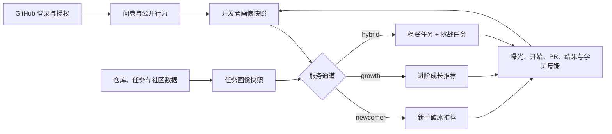
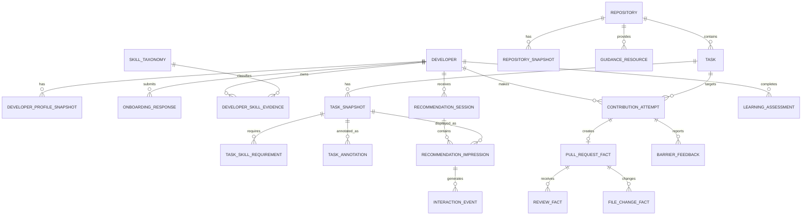

# OSS-Mentor 数据字典 v0.1

## 1. 文档信息

| 项目 | 内容 |
|---|---|
| 文档状态 | Draft / 讨论版 |
| 版本 | v0.1 |
| 更新日期 | 2026-07-12 |
| 覆盖用户 | 零贡献/首次贡献者、进阶开发者 |
| 核心样本单位 | `developer_profile_snapshot × task_snapshot × recommendation_time` |
| 数据范围 | GitHub 公共数据、用户主动授权数据、OSS-Mentor 产品行为、人工标注和用户研究数据 |

本字典用于统一数据采集、数据库设计、特征工程、模型训练和效果评测中的字段口径。v0.1 优先保证“可采集、可解释、无未来信息泄漏”，字段会在首轮数据试采后调整。

## 2. 产品目标与双通道设计

OSS-Mentor 使用一套共同数据层支持两类推荐服务：

- `newcomer`：服务零贡献或首次贡献者，目标是降低启动门槛、减少受阻并提高首次 PR 创建与合并概率。
- `growth`：服务有一定贡献历史的开发者，目标是推荐略高于当前能力的任务，提高技能扩展与学习增益。
- `hybrid`：历史证据较少但并非完全冷启动，或用户同时希望“稳妥完成”和“适度挑战”时，混合两类任务。

## 3. 数据设计原则

### 3.1 时间阶段必须分离

| 阶段 | 代码 | 定义 | 典型数据 |
|---|---|---|---|
| 推荐时 | `T0` | 生成推荐时已经存在的信息，可作为线上模型输入 | Issue 当时的正文和标签、仓库历史统计、用户历史画像 |
| 贡献过程 | `T1` | 用户接受任务后逐渐产生的信息 | 点击、收藏、开始、PR 创建、CI 过程、评论互动 |
| 事后结果 | `T2` | 贡献结束或观察窗口结束后才能确认的信息 | 是否合并、最终改动行数、Review 轮次、实际耗时、受阻原因 |

任何 `T1`、`T2` 字段不得用于预测同一条样本在 `T0` 时刻的结果。历史任务的 `T2` 数据可以聚合成截至新推荐时刻已经可见的用户或仓库历史特征。

### 3.2 快照优先

Issue 正文、标签、指派状态、仓库活跃度和用户画像都会变化。所有用于推荐和训练的数据必须保留 `snapshot_at`，不得只保存对象的最终状态。

### 3.3 公共身份与研究身份分离

- 业务表只使用随机生成的 `developer_id`。
- GitHub 用户 ID、login 与 `developer_id` 的映射单独存储并加密。
- OAuth token 不进入分析库、日志或训练数据。
- 默认不采集邮箱、年龄、性别、国籍、精确位置、私有仓库和教育背景。

### 3.4 缺失值不等于零

- `NULL`：未知、不可访问或尚未采集。
- `0`：已确认数量为零或评分为零。
- `not_applicable`：该字段不适用于当前对象。

## 4. 类型、优先级与隐私等级

### 4.1 字段类型

| 类型 | 说明 |
|---|---|
| `uuid` | OSS-Mentor 内部随机标识符 |
| `bigint` | GitHub 稳定数字 ID、计数 |
| `text` | 文本或枚举值 |
| `boolean` | `true` / `false` |
| `integer` | 整数评分或计数 |
| `numeric(p,s)` | 小数评分或比例 |
| `timestamptz` | UTC 时间戳，展示时转换到用户时区 |
| `date` | 日期 |
| `jsonb` | 结构可能扩展的对象；核心检索字段不得只存在于 JSON 中 |
| `text[]` | 小规模字符串数组 |
| `uuid[]` | 小规模内部 ID 数组；高基数多对多关系仍应使用关联表 |
| `vector` | 模型生成的向量，仅保存模型版本明确的派生表示 |

### 4.2 优先级

| 等级 | 含义 |
|---|---|
| `P0` | 第一阶段必须采集，支撑共同数据层和基础推荐 |
| `P1` | 第二阶段采集，支撑进阶推荐、路径规划或更可靠评测 |
| `P2` | 研究增强项，数据和方法验证后再加入 |

### 4.3 隐私等级

| 等级 | 含义 | 示例 |
|---|---|---|
| `L0` | 公共项目数据 | 仓库 ID、Issue 标签 |
| `L1` | 假名化行为数据 | 内部开发者 ID、贡献聚合特征 |
| `L2` | 用户主动提供或可识别数据 | 自评问卷、GitHub login 映射 |
| `L3` | 凭证和高敏感数据，禁止进入分析库 | OAuth token、加密密钥 |

## 5. 实体关系总览

## 6. 核心实体与字段

### 6.1 `developer`

开发者业务主表。可识别的 GitHub 身份映射不得直接存放在本表。

| 字段 | 类型 | 必填 | 阶段 | 优先级 | 隐私 | 定义 |
|---|---|---:|---|---|---|---|
| `developer_id` | `uuid` | 是 | T0 | P0 | L1 | OSS-Mentor 内部开发者 ID |
| `account_status` | `text` | 是 | T0 | P0 | L1 | `active`、`revoked`、`deleted`、`suspended` |
| `service_track` | `text` | 是 | T0 | P0 | L1 | `newcomer`、`growth`、`hybrid`、`unknown` |
| `service_track_source` | `text` | 是 | T0 | P0 | L1 | `rule`、`model`、`user_selected`、`admin` |
| `service_track_confidence` | `numeric(4,3)` | 否 | T0 | P1 | L1 | 通道判断置信度，范围 `[0,1]` |
| `preferred_locale` | `text` | 否 | T0 | P0 | L2 | 用户界面和导学提示语言，如 `zh-CN` |
| `timezone` | `text` | 否 | T0 | P1 | L2 | IANA 时区，仅用于时间展示和提醒 |
| `created_at` | `timestamptz` | 是 | T0 | P0 | L1 | 账户创建时间 |
| `consent_version` | `text` | 是 | T0 | P0 | L2 | 用户同意的数据处理说明版本 |
| `consented_at` | `timestamptz` | 是 | T0 | P0 | L2 | 同意时间 |
| `authorization_revoked_at` | `timestamptz` | 否 | T1 | P0 | L2 | 撤回 GitHub 授权时间 |
| `deleted_at` | `timestamptz` | 否 | T1 | P0 | L2 | 用户请求删除的时间 |

### 6.2 `github_identity_map`

与分析库隔离的身份映射表。

| 字段 | 类型 | 必填 | 优先级 | 隐私 | 定义 |
|---|---|---:|---|---|---|
| `developer_id` | `uuid` | 是 | P0 | L2 | 内部开发者 ID |
| `github_user_id` | `bigint` | 是 | P0 | L2 | GitHub 稳定数字用户 ID，账号改名后仍可关联 |
| `github_login_encrypted` | `text` | 是 | P0 | L2 | 加密保存的 GitHub login |
| `scope_set` | `text[]` | 是 | P0 | L2 | 用户实际授权的最小权限集合 |
| `token_secret_ref` | `text` | 否 | P0 | L3 | 密钥管理系统中的引用；禁止保存 token 明文 |
| `last_verified_at` | `timestamptz` | 是 | P0 | L2 | 最近一次确认映射有效的时间 |

### 6.3 `onboarding_response`

冷启动问卷。用户可跳过非必需问题，且可以后续修改。

| 字段 | 类型 | 必填 | 阶段 | 优先级 | 隐私 | 定义 |
|---|---|---:|---|---|---|---|
| `response_id` | `uuid` | 是 | T0 | P0 | L1 | 问卷提交 ID |
| `developer_id` | `uuid` | 是 | T0 | P0 | L1 | 开发者 ID |
| `submitted_at` | `timestamptz` | 是 | T0 | P0 | L1 | 提交时间 |
| `questionnaire_version` | `text` | 是 | T0 | P0 | L1 | 问卷版本 |
| `git_skill_self` | `integer` | 否 | T0 | P0 | L2 | Git 熟练度，`0–4` |
| `github_workflow_skill_self` | `integer` | 否 | T0 | P0 | L2 | Fork、branch、PR、Review 流程熟练度，`0–4` |
| `testing_skill_self` | `integer` | 否 | T0 | P0 | L2 | 编写和运行测试的熟练度，`0–4` |
| `build_ci_skill_self` | `integer` | 否 | T0 | P0 | L2 | 构建工具和 CI 排错熟练度，`0–4` |
| `weekly_hours_available` | `numeric(4,1)` | 否 | T0 | P0 | L2 | 每周预计可投入小时数；建议限制在合理范围 |
| `preferred_task_types` | `text[]` | 否 | T0 | P0 | L2 | 用户偏好的任务类型 |
| `interest_topics` | `text[]` | 否 | T0 | P0 | L2 | 用户主动选择的技术或领域兴趣 |
| `growth_goal` | `text` | 否 | T0 | P0 | L2 | `first_pr`、`practice_skill`、`learn_new_skill`、`join_community`、`deep_contribution` |
| `challenge_preference` | `text` | 否 | T0 | P0 | L2 | `safe`、`balanced`、`challenging` |
| `preferred_task_duration` | `text` | 否 | T0 | P0 | L2 | `under_2h`、`half_day`、`one_day`、`multi_day`、`unsure` |
| `language_skill_self` | `jsonb` | 否 | T0 | P0 | L2 | `{skill_id: level_0_to_4}` |
| `framework_skill_self` | `jsonb` | 否 | T0 | P1 | L2 | `{skill_id: level_0_to_4}` |
| `accessibility_needs` | `text[]` | 否 | T0 | P2 | L2 | 用户主动选择的界面辅助需求，不用于能力评分 |

不采集或不作为默认推荐特征：学校、学历、成绩、年龄、性别、国籍、真实姓名和邮箱。

### 6.4 `developer_profile_snapshot`

推荐时使用的开发者画像快照。所有行为统计只能使用 `snapshot_at` 之前的数据。

| 字段 | 类型 | 必填 | 阶段 | 优先级 | 隐私 | 定义 |
|---|---|---:|---|---|---|---|
| `profile_snapshot_id` | `uuid` | 是 | T0 | P0 | L1 | 画像快照 ID |
| `developer_id` | `uuid` | 是 | T0 | P0 | L1 | 开发者 ID |
| `snapshot_at` | `timestamptz` | 是 | T0 | P0 | L1 | 快照时间 |
| `feature_window_days` | `integer` | 是 | T0 | P0 | L1 | 行为特征观察窗口，如 `365` |
| `service_track` | `text` | 是 | T0 | P0 | L1 | 本快照适用的推荐通道 |
| `observed_external_pr_count` | `integer` | 是 | T0 | P0 | L1 | 窗口内观察到的外部公共 PR 数 |
| `observed_merged_pr_count` | `integer` | 是 | T0 | P0 | L1 | 窗口内已合并的外部公共 PR 数 |
| `observed_review_count` | `integer` | 是 | T0 | P1 | L1 | 窗口内对他人 PR 的有效 Review 数 |
| `active_contribution_days` | `integer` | 是 | T0 | P0 | L1 | 窗口内发生有效贡献的不同日期数 |
| `active_contribution_months` | `integer` | 是 | T0 | P1 | L1 | 窗口内发生有效贡献的不同月份数 |
| `contributed_repository_count` | `integer` | 是 | T0 | P0 | L1 | 窗口内贡献过的不同仓库数 |
| `contribution_type_distribution` | `jsonb` | 否 | T0 | P0 | L1 | 文档、测试、Bug 等类型的历史分布 |
| `language_evidence_scores` | `jsonb` | 否 | T0 | P0 | L1 | 按技能聚合的证据分数与置信度 |
| `framework_evidence_scores` | `jsonb` | 否 | T0 | P1 | L1 | 框架或工具链证据分数 |
| `experience_score` | `numeric(5,2)` | 否 | T0 | P0 | L1 | 经验维度分数，建议标准化到 `0–100` |
| `technical_breadth_score` | `numeric(5,2)` | 否 | T0 | P1 | L1 | 技术覆盖广度，`0–100` |
| `collaboration_score` | `numeric(5,2)` | 否 | T0 | P1 | L1 | Review、响应和协作行为的聚合分数，`0–100` |
| `quality_stability_score` | `numeric(5,2)` | 否 | T0 | P1 | L1 | 历史贡献质量稳定性，不能只用合并率定义 |
| `growth_velocity_score` | `numeric(5,2)` | 否 | T0 | P2 | L1 | 技能和任务难度随时间的变化速度 |
| `profile_confidence` | `numeric(4,3)` | 是 | T0 | P0 | L1 | 整体画像置信度，范围 `[0,1]` |
| `feature_definition_version` | `text` | 是 | T0 | P0 | L1 | 特征公式版本 |
| `source_cutoff_at` | `timestamptz` | 是 | T0 | P0 | L1 | 画像所使用数据的最晚时间，必须不晚于 `snapshot_at` |

### 6.5 `skill_taxonomy`

统一用户技能和任务要求，避免自由文本无法匹配。

| 字段 | 类型 | 必填 | 优先级 | 隐私 | 定义 |
|---|---|---:|---|---|---|
| `skill_id` | `text` | 是 | P0 | L0 | 稳定技能 ID，如 `lang.python`、`tool.git` |
| `skill_name` | `text` | 是 | P0 | L0 | 展示名称 |
| `skill_type` | `text` | 是 | P0 | L0 | `language`、`framework`、`tool`、`testing`、`domain`、`collaboration` |
| `parent_skill_id` | `text` | 否 | P1 | L0 | 父级技能 ID |
| `aliases` | `text[]` | 否 | P0 | L0 | 文本抽取时使用的别名 |
| `prerequisite_skill_ids` | `text[]` | 否 | P1 | L0 | 前置技能列表 |
| `taxonomy_version` | `text` | 是 | P0 | L0 | 技能体系版本 |
| `active` | `boolean` | 是 | P0 | L0 | 当前是否继续使用 |

### 6.6 `developer_skill_evidence`

记录技能判断依据，使画像可解释。Star 仅表示兴趣，不得作为能力证据。

| 字段 | 类型 | 必填 | 阶段 | 优先级 | 隐私 | 定义 |
|---|---|---:|---|---|---|---|
| `evidence_id` | `uuid` | 是 | T0 | P1 | L1 | 技能证据 ID |
| `developer_id` | `uuid` | 是 | T0 | P1 | L1 | 开发者 ID |
| `skill_id` | `text` | 是 | T0 | P1 | L1 | 技能 ID |
| `evidence_type` | `text` | 是 | T0 | P1 | L1 | `self_report`、`merged_pr`、`review`、`commit`、`task_feedback`、`assessment` |
| `source_object_id` | `text` | 否 | T0 | P1 | L1 | 来源对象 ID，不保存无必要的正文 |
| `observed_at` | `timestamptz` | 是 | T0 | P1 | L1 | 证据发生时间 |
| `evidence_weight` | `numeric(5,3)` | 是 | T0 | P1 | L1 | 该类证据的预设可靠性权重 |
| `evidence_score` | `numeric(5,2)` | 是 | T0 | P1 | L1 | 对该技能的正向或负向贡献 |
| `confidence` | `numeric(4,3)` | 是 | T0 | P1 | L1 | 证据置信度，范围 `[0,1]` |
| `expires_at` | `timestamptz` | 否 | T0 | P2 | L1 | 可选的证据衰减截止时间 |

### 6.7 `repository`

GitHub 仓库稳定身份表。

| 字段 | 类型 | 必填 | 优先级 | 隐私 | 定义 |
|---|---|---:|---|---|---|
| `repository_id` | `uuid` | 是 | P0 | L0 | 内部仓库 ID |
| `github_repository_id` | `bigint` | 是 | P0 | L0 | GitHub 数字仓库 ID |
| `full_name` | `text` | 是 | P0 | L0 | `owner/name`，允许改名更新 |
| `html_url` | `text` | 是 | P0 | L0 | GitHub 页面 URL |
| `is_fork` | `boolean` | 是 | P0 | L0 | 是否为 fork |
| `is_archived` | `boolean` | 是 | P0 | L0 | 是否归档 |
| `is_mirror` | `boolean` | 否 | P0 | L0 | 是否为镜像 |
| `license_spdx_id` | `text` | 否 | P0 | L0 | SPDX 许可证标识 |
| `default_branch` | `text` | 是 | P0 | L0 | 默认分支 |
| `first_collected_at` | `timestamptz` | 是 | P0 | L0 | 首次纳入数据集的时间 |
| `collection_status` | `text` | 是 | P0 | L0 | `active`、`paused`、`excluded`、`deleted`、`private` |
| `exclusion_reason` | `text` | 否 | P0 | L0 | 排除原因 |

### 6.8 `repository_snapshot`

推荐时的仓库状态和新人友好度特征。

| 字段 | 类型 | 必填 | 阶段 | 优先级 | 隐私 | 定义 |
|---|---|---:|---|---|---|---|
| `repository_snapshot_id` | `uuid` | 是 | T0 | P0 | L0 | 仓库快照 ID |
| `repository_id` | `uuid` | 是 | T0 | P0 | L0 | 仓库 ID |
| `snapshot_at` | `timestamptz` | 是 | T0 | P0 | L0 | 快照时间 |
| `primary_language` | `text` | 否 | T0 | P0 | L0 | 主语言 |
| `language_distribution` | `jsonb` | 否 | T0 | P0 | L0 | GitHub 语言字节分布 |
| `topics` | `text[]` | 否 | T0 | P0 | L0 | 仓库 topics |
| `star_count` | `integer` | 是 | T0 | P0 | L0 | Star 数，仅作背景和采样分层，不直接代表质量 |
| `fork_count` | `integer` | 是 | T0 | P1 | L0 | Fork 数 |
| `open_issue_count` | `integer` | 是 | T0 | P0 | L0 | 开放 Issue 数 |
| `active_contributor_count_90d` | `integer` | 否 | T0 | P0 | L0 | 近 90 天活跃贡献者数 |
| `commit_count_90d` | `integer` | 否 | T0 | P0 | L0 | 默认分支近 90 天 Commit 数 |
| `median_first_response_hours_180d` | `numeric(8,2)` | 否 | T0 | P0 | L0 | 历史 Issue/PR 首次有效响应中位数 |
| `median_pr_merge_hours_180d` | `numeric(8,2)` | 否 | T0 | P1 | L0 | 已合并 PR 的合并耗时中位数 |
| `first_project_pr_merge_rate_180d` | `numeric(5,4)` | 否 | T0 | P1 | L0 | 项目新贡献者 PR 的历史合并率；不等同社区质量 |
| `maintainer_response_coverage_180d` | `numeric(5,4)` | 否 | T0 | P1 | L0 | 获得维护者响应的外部 Issue/PR 比例 |
| `has_readme` | `boolean` | 是 | T0 | P0 | L0 | 是否存在 README |
| `has_contributing_guide` | `boolean` | 是 | T0 | P0 | L0 | 是否存在贡献指南 |
| `has_code_of_conduct` | `boolean` | 是 | T0 | P1 | L0 | 是否存在行为准则 |
| `has_issue_template` | `boolean` | 是 | T0 | P0 | L0 | 是否存在 Issue 模板 |
| `has_pr_template` | `boolean` | 是 | T0 | P1 | L0 | 是否存在 PR 模板 |
| `has_ci_config` | `boolean` | 是 | T0 | P0 | L0 | 是否检测到 CI 配置 |
| `has_setup_documentation` | `boolean` | 否 | T0 | P0 | L0 | 是否存在可识别的环境搭建说明 |
| `community_support_score` | `numeric(5,2)` | 否 | T0 | P1 | L0 | 基于文档、响应和新人历史的组合分数 |
| `feature_definition_version` | `text` | 是 | T0 | P0 | L0 | 特征公式版本 |

### 6.9 `guidance_resource`

为新手导学和进阶任务准备的项目资源索引。

| 字段 | 类型 | 必填 | 阶段 | 优先级 | 隐私 | 定义 |
|---|---|---:|---|---|---|---|
| `resource_id` | `uuid` | 是 | T0 | P0 | L0 | 资源 ID |
| `repository_id` | `uuid` | 是 | T0 | P0 | L0 | 仓库 ID |
| `resource_type` | `text` | 是 | T0 | P0 | L0 | `setup`、`contributing`、`testing`、`code_style`、`architecture`、`communication`、`security` |
| `source_url` | `text` | 是 | T0 | P0 | L0 | 原始资源 URL |
| `source_commit_sha` | `text` | 否 | T0 | P0 | L0 | 文档所在版本 |
| `title` | `text` | 否 | T0 | P0 | L0 | 资源标题 |
| `extracted_summary` | `text` | 否 | T0 | P1 | L0 | 自动摘要，必须可追溯到来源 |
| `command_snippets` | `jsonb` | 否 | T0 | P1 | L0 | 结构化安装、构建或测试命令；展示前需安全过滤 |
| `last_verified_at` | `timestamptz` | 是 | T0 | P0 | L0 | 最近验证资源仍有效的时间 |
| `quality_score` | `numeric(5,2)` | 否 | T0 | P1 | L0 | 完整度、新鲜度和可执行性评分 |

### 6.10 `task`

任务稳定身份表。v0.1 主要以 GitHub Issue 为任务载体。

| 字段 | 类型 | 必填 | 优先级 | 隐私 | 定义 |
|---|---|---:|---|---|---|
| `task_id` | `uuid` | 是 | P0 | L0 | 内部任务 ID |
| `repository_id` | `uuid` | 是 | P0 | L0 | 所属仓库 |
| `github_issue_id` | `bigint` | 是 | P0 | L0 | GitHub Issue 数字 ID |
| `issue_number` | `integer` | 是 | P0 | L0 | 仓库内 Issue 编号 |
| `html_url` | `text` | 是 | P0 | L0 | Issue 页面 URL |
| `created_at` | `timestamptz` | 是 | P0 | L0 | Issue 创建时间 |
| `author_association` | `text` | 否 | P1 | L0 | 作者与仓库的关系，如 `MEMBER`、`CONTRIBUTOR` |
| `first_collected_at` | `timestamptz` | 是 | P0 | L0 | 首次采集时间 |

### 6.11 `task_snapshot`

推荐候选任务的核心快照表。

| 字段 | 类型 | 必填 | 阶段 | 优先级 | 隐私 | 定义 |
|---|---|---:|---|---|---|---|
| `task_snapshot_id` | `uuid` | 是 | T0 | P0 | L0 | 任务快照 ID |
| `task_id` | `uuid` | 是 | T0 | P0 | L0 | 任务 ID |
| `repository_snapshot_id` | `uuid` | 是 | T0 | P0 | L0 | 同期仓库快照 ID |
| `snapshot_at` | `timestamptz` | 是 | T0 | P0 | L0 | 快照时间 |
| `title` | `text` | 是 | T0 | P0 | L0 | 当时的 Issue 标题 |
| `body_text` | `text` | 否 | T0 | P0 | L0 | 清洗后的当时正文；原始正文应设置保留期限 |
| `labels` | `text[]` | 是 | T0 | P0 | L0 | 当时标签集合 |
| `state` | `text` | 是 | T0 | P0 | L0 | `open`、`closed` |
| `assignment_state` | `text` | 是 | T0 | P0 | L0 | `unassigned`、`assigned`、`claimed_in_comments`、`unknown` |
| `has_linked_open_pr` | `boolean` | 是 | T0 | P0 | L0 | 当时是否已有正在处理的关联 PR |
| `comment_count` | `integer` | 是 | T0 | P0 | L0 | 截至快照时的评论数 |
| `participant_count` | `integer` | 否 | T0 | P1 | L0 | 截至快照时的不同参与者数 |
| `age_days` | `integer` | 是 | T0 | P0 | L0 | 创建到快照时的天数 |
| `last_activity_at` | `timestamptz` | 否 | T0 | P0 | L0 | 截至快照时的最后活动时间 |
| `is_stale_candidate` | `boolean` | 是 | T0 | P0 | L0 | 是否达到项目定义的疑似过期阈值 |
| `has_reproduction_steps` | `boolean` | 否 | T0 | P0 | L0 | 是否包含复现步骤 |
| `has_acceptance_criteria` | `boolean` | 否 | T0 | P0 | L0 | 是否包含明确验收标准 |
| `has_expected_behavior` | `boolean` | 否 | T0 | P0 | L0 | 是否描述预期行为 |
| `has_affected_module_hint` | `boolean` | 否 | T0 | P0 | L0 | 是否指出可能受影响模块或路径 |
| `task_types` | `text[]` | 否 | T0 | P0 | L0 | 自动或人工识别的任务类型，可多选 |
| `text_clarity_score` | `numeric(5,2)` | 否 | T0 | P0 | L0 | Issue 清晰度，`0–100` |
| `estimated_code_difficulty` | `integer` | 否 | T0 | P0 | L0 | 推荐时估计的代码难度，`0–3` |
| `estimated_setup_difficulty` | `integer` | 否 | T0 | P0 | L0 | 环境搭建难度，`0–3` |
| `estimated_project_context_difficulty` | `integer` | 否 | T0 | P0 | L0 | 项目理解难度，`0–3` |
| `estimated_collaboration_difficulty` | `integer` | 否 | T0 | P1 | L0 | 沟通与协作难度，`0–3` |
| `estimated_effort_bucket` | `text` | 否 | T0 | P0 | L0 | `under_2h`、`half_day`、`one_day`、`multi_day`、`unknown` |
| `novice_fit_probability` | `numeric(4,3)` | 否 | T0 | P0 | L0 | 新手适配概率，范围 `[0,1]` |
| `growth_value_score` | `numeric(5,2)` | 否 | T0 | P1 | L0 | 对进阶用户的预期技能扩展价值，`0–100` |
| `candidate_eligibility` | `text` | 是 | T0 | P0 | L0 | `eligible`、`temporarily_ineligible`、`excluded`、`unknown` |
| `ineligibility_reasons` | `text[]` | 否 | T0 | P0 | L0 | 已认领、已有 PR、过期、项目归档等原因 |
| `feature_definition_version` | `text` | 是 | T0 | P0 | L0 | 特征公式版本 |
| `embedding_model_version` | `text` | 否 | T0 | P2 | L0 | 文本/代码向量模型版本 |
| `text_embedding` | `vector` | 否 | T0 | P2 | L0 | Issue 文本向量 |

`final_additions`、`final_deletions`、`final_changed_files`、`review_rounds` 和最终 CI 结果不得出现在本表中，它们属于贡献结果。

### 6.12 `task_skill_requirement`

| 字段 | 类型 | 必填 | 阶段 | 优先级 | 隐私 | 定义 |
|---|---|---:|---|---|---|---|
| `task_snapshot_id` | `uuid` | 是 | T0 | P0 | L0 | 任务快照 ID |
| `skill_id` | `text` | 是 | T0 | P0 | L0 | 技能 ID |
| `required_level` | `integer` | 否 | T0 | P0 | L0 | 建议最低等级，`0–4` |
| `requirement_type` | `text` | 是 | T0 | P0 | L0 | `required`、`preferred`、`growth_target` |
| `source` | `text` | 是 | T0 | P0 | L0 | `label_rule`、`text_model`、`code_analysis`、`human` |
| `confidence` | `numeric(4,3)` | 是 | T0 | P0 | L0 | 识别置信度，范围 `[0,1]` |
| `evidence_excerpt` | `text` | 否 | T0 | P1 | L0 | 最短必要证据片段，避免复制大段正文 |
| `model_or_rubric_version` | `text` | 是 | T0 | P0 | L0 | 自动模型或人工规范版本 |

### 6.13 `task_annotation`

任务人工标注表。标注员应只查看推荐时可见信息，标注过程中隐藏最终 PR 结果。

| 字段 | 类型 | 必填 | 阶段 | 优先级 | 隐私 | 定义 |
|---|---|---:|---|---|---|---|
| `annotation_id` | `uuid` | 是 | T0 | P0 | L1 | 标注 ID |
| `task_snapshot_id` | `uuid` | 是 | T0 | P0 | L0 | 被标注快照 |
| `annotator_id` | `uuid` | 是 | T0 | P0 | L1 | 假名化标注员 ID |
| `rubric_version` | `text` | 是 | T0 | P0 | L0 | 标注规范版本 |
| `task_types` | `text[]` | 是 | T0 | P0 | L0 | 人工任务类型 |
| `code_difficulty` | `integer` | 是 | T0 | P0 | L0 | `0–3` |
| `setup_difficulty` | `integer` | 是 | T0 | P0 | L0 | `0–3` |
| `project_context_difficulty` | `integer` | 是 | T0 | P0 | L0 | `0–3` |
| `collaboration_difficulty` | `integer` | 是 | T0 | P0 | L0 | `0–3` |
| `novice_fit` | `text` | 是 | T0 | P0 | L0 | `suitable`、`possibly_suitable`、`unsuitable`、`insufficient_info` |
| `clarity_score` | `integer` | 是 | T0 | P0 | L0 | `0–3` |
| `estimated_effort_bucket` | `text` | 是 | T0 | P0 | L0 | 人工估计耗时档位 |
| `reason_codes` | `text[]` | 是 | T0 | P0 | L0 | 标注理由代码 |
| `free_text_note` | `text` | 否 | T0 | P1 | L1 | 简短补充说明 |
| `created_at` | `timestamptz` | 是 | T0 | P0 | L1 | 标注时间 |

### 6.14 `recommendation_session`

一次推荐请求或页面刷新产生一个会话。

| 字段 | 类型 | 必填 | 阶段 | 优先级 | 隐私 | 定义 |
|---|---|---:|---|---|---|---|
| `recommendation_session_id` | `uuid` | 是 | T0 | P0 | L1 | 推荐会话 ID |
| `developer_id` | `uuid` | 是 | T0 | P0 | L1 | 开发者 ID |
| `profile_snapshot_id` | `uuid` | 是 | T0 | P0 | L1 | 使用的画像快照 |
| `service_track` | `text` | 是 | T0 | P0 | L1 | 本次推荐通道 |
| `requested_at` | `timestamptz` | 是 | T0 | P0 | L1 | 请求时间 |
| `model_name` | `text` | 是 | T0 | P0 | L0 | 推荐模型或规则名称 |
| `model_version` | `text` | 是 | T0 | P0 | L0 | 模型版本 |
| `experiment_id` | `text` | 否 | T0 | P1 | L1 | 实验或基线分组 ID |
| `candidate_set_definition` | `text` | 是 | T0 | P0 | L0 | 候选集生成规则版本 |
| `candidate_count` | `integer` | 是 | T0 | P0 | L1 | 排序前候选任务数 |
| `result_count` | `integer` | 是 | T0 | P0 | L1 | 返回任务数 |
| `challenge_mix_ratio` | `numeric(4,3)` | 否 | T0 | P1 | L1 | 进阶/混合推荐中的挑战任务比例 |

### 6.15 `recommendation_impression`

记录“实际展示了什么”，是离线复现和负反馈解释的基础。

| 字段 | 类型 | 必填 | 阶段 | 优先级 | 隐私 | 定义 |
|---|---|---:|---|---|---|---|
| `impression_id` | `uuid` | 是 | T0 | P0 | L1 | 曝光 ID |
| `recommendation_session_id` | `uuid` | 是 | T0 | P0 | L1 | 推荐会话 ID |
| `task_snapshot_id` | `uuid` | 是 | T0 | P0 | L0 | 被展示的任务快照 |
| `rank_position` | `integer` | 是 | T0 | P0 | L1 | 展示排名，从 1 开始 |
| `recommendation_score` | `numeric(10,6)` | 是 | T0 | P0 | L1 | 模型原始排序分数 |
| `completion_probability` | `numeric(4,3)` | 否 | T0 | P0 | L1 | 预测完成概率 |
| `growth_value_score` | `numeric(5,2)` | 否 | T0 | P1 | L1 | 预测学习/成长价值 |
| `difficulty_gap` | `numeric(6,3)` | 否 | T0 | P1 | L1 | 任务能力要求与用户能力的差值 |
| `recommendation_reason_codes` | `text[]` | 是 | T0 | P0 | L1 | 可解释推荐理由代码 |
| `displayed_at` | `timestamptz` | 是 | T0 | P0 | L1 | 首次进入可视区域的时间 |
| `was_viewable` | `boolean` | 是 | T0 | P0 | L1 | 是否满足产品定义的有效曝光条件 |

### 6.16 `interaction_event`

产品内行为事件采用追加写入，不覆盖历史事件。

| 字段 | 类型 | 必填 | 阶段 | 优先级 | 隐私 | 定义 |
|---|---|---:|---|---|---|---|
| `event_id` | `uuid` | 是 | T1 | P0 | L1 | 事件 ID |
| `developer_id` | `uuid` | 是 | T1 | P0 | L1 | 开发者 ID |
| `impression_id` | `uuid` | 否 | T1 | P0 | L1 | 对应曝光；非推荐来源可为空 |
| `task_id` | `uuid` | 否 | T1 | P0 | L0 | 对应任务 |
| `event_type` | `text` | 是 | T1 | P0 | L1 | 见第 7 节枚举 |
| `occurred_at` | `timestamptz` | 是 | T1 | P0 | L1 | 客户端事件时间 |
| `received_at` | `timestamptz` | 是 | T1 | P0 | L1 | 服务端接收时间 |
| `client_event_id` | `text` | 否 | T1 | P0 | L1 | 客户端幂等键 |
| `session_id` | `uuid` | 否 | T1 | P0 | L1 | 产品访问会话 ID |
| `metadata` | `jsonb` | 否 | T1 | P1 | L1 | 限定白名单字段，禁止写入 token 和任意页面文本 |

### 6.17 `contribution_attempt`

从“开始任务”到贡献结束的业务过程。没有创建 PR 的尝试也必须保留。

| 字段 | 类型 | 必填 | 阶段 | 优先级 | 隐私 | 定义 |
|---|---|---:|---|---|---|---|
| `attempt_id` | `uuid` | 是 | T1 | P0 | L1 | 尝试 ID |
| `developer_id` | `uuid` | 是 | T1 | P0 | L1 | 开发者 ID |
| `task_id` | `uuid` | 是 | T1 | P0 | L0 | 目标任务 |
| `origin_impression_id` | `uuid` | 否 | T1 | P0 | L1 | 由哪次推荐触发；自然发现可为空 |
| `attempt_source` | `text` | 是 | T1 | P0 | L1 | `recommended`、`organic`、`maintainer_assigned`、`unknown` |
| `started_at` | `timestamptz` | 是 | T1 | P0 | L1 | 用户确认开始或系统识别的时间 |
| `claimed_at` | `timestamptz` | 否 | T1 | P1 | L1 | 在项目中认领任务的时间 |
| `pr_created_at` | `timestamptz` | 否 | T1 | P0 | L1 | PR 创建时间 |
| `ended_at` | `timestamptz` | 否 | T2 | P0 | L1 | 尝试结束或观察窗口截止时间 |
| `attempt_outcome` | `text` | 否 | T2 | P0 | L1 | 见第 7 节枚举 |
| `outcome_observed_at` | `timestamptz` | 否 | T2 | P0 | L1 | 结果确认时间 |
| `is_first_observed_project_pr` | `boolean` | 否 | T2 | P0 | L1 | 是否为观察范围内对该项目的首次外部 PR |
| `is_first_observed_public_pr` | `boolean` | 否 | T2 | P1 | L1 | 是否为数据可见范围内的首次公共外部 PR；不得宣称绝对首次 |
| `self_reported_minutes_spent` | `integer` | 否 | T2 | P1 | L2 | 用户自报实际耗时 |
| `outcome_reason_codes` | `text[]` | 否 | T2 | P0 | L1 | 结果原因，避免把所有未合并都归因于能力 |

### 6.18 `pull_request_fact`

| 字段 | 类型 | 必填 | 阶段 | 优先级 | 隐私 | 定义 |
|---|---|---:|---|---|---|---|
| `pull_request_id` | `uuid` | 是 | T1 | P0 | L0 | 内部 PR ID |
| `attempt_id` | `uuid` | 否 | T1 | P0 | L1 | 对应贡献尝试 |
| `github_pull_request_id` | `bigint` | 是 | T1 | P0 | L0 | GitHub PR 数字 ID |
| `repository_id` | `uuid` | 是 | T1 | P0 | L0 | 目标仓库 |
| `pr_number` | `integer` | 是 | T1 | P0 | L0 | 仓库内 PR 编号 |
| `html_url` | `text` | 是 | T1 | P0 | L0 | PR URL |
| `opened_at` | `timestamptz` | 是 | T1 | P0 | L0 | 打开时间 |
| `closed_at` | `timestamptz` | 否 | T2 | P0 | L0 | 关闭时间 |
| `merged_at` | `timestamptz` | 否 | T2 | P0 | L0 | 合并时间 |
| `state` | `text` | 是 | T1/T2 | P0 | L0 | `open`、`closed`、`merged` |
| `linked_task_ids` | `uuid[]` | 否 | T1 | P0 | L0 | 关联任务 ID，可一对多 |
| `link_method` | `text` | 否 | T1 | P0 | L0 | `closing_reference`、`timeline`、`manual`、`text_heuristic` |
| `link_confidence` | `numeric(4,3)` | 否 | T1 | P0 | L0 | Issue–PR 关联置信度 |
| `commit_count_final` | `integer` | 否 | T2 | P0 | L0 | 最终提交数 |
| `additions_final` | `integer` | 否 | T2 | P0 | L0 | 最终增加行数 |
| `deletions_final` | `integer` | 否 | T2 | P0 | L0 | 最终删除行数 |
| `changed_files_final` | `integer` | 否 | T2 | P0 | L0 | 最终修改文件数 |
| `review_round_count` | `integer` | 否 | T2 | P0 | L0 | 按规范定义的 Review/修改轮次 |
| `change_request_count` | `integer` | 否 | T2 | P0 | L0 | `CHANGES_REQUESTED` 次数 |
| `first_response_hours` | `numeric(8,2)` | 否 | T2 | P0 | L0 | PR 到首次有效社区响应耗时 |
| `merge_hours` | `numeric(8,2)` | 否 | T2 | P0 | L0 | PR 打开到合并耗时 |
| `ci_final_state` | `text` | 否 | T2 | P0 | L0 | `success`、`failure`、`cancelled`、`missing`、`unknown` |
| `is_bot_authored` | `boolean` | 是 | T1 | P0 | L0 | 是否由 bot 创建；默认排除画像训练 |
| `snapshot_finalized_at` | `timestamptz` | 否 | T2 | P0 | L0 | 结果快照冻结时间 |

### 6.19 `review_fact`

| 字段 | 类型 | 必填 | 阶段 | 优先级 | 隐私 | 定义 |
|---|---|---:|---|---|---|---|
| `review_id` | `uuid` | 是 | T1 | P1 | L0 | Review ID |
| `pull_request_id` | `uuid` | 是 | T1 | P1 | L0 | PR ID |
| `reviewer_actor_id` | `text` | 否 | T1 | P1 | L1 | 假名化 Reviewer ID；不要求是系统用户 |
| `review_state` | `text` | 是 | T1 | P1 | L0 | `approved`、`changes_requested`、`commented`、`dismissed` |
| `submitted_at` | `timestamptz` | 是 | T1 | P1 | L0 | 提交时间 |
| `is_maintainer_review` | `boolean` | 否 | T1 | P1 | L0 | 是否来自维护者/成员 |
| `comment_count` | `integer` | 否 | T1 | P1 | L0 | Review 内评论数 |

### 6.20 `file_change_fact`

| 字段 | 类型 | 必填 | 阶段 | 优先级 | 隐私 | 定义 |
|---|---|---:|---|---|---|---|
| `file_change_id` | `uuid` | 是 | T2 | P1 | L0 | 文件变更 ID |
| `pull_request_id` | `uuid` | 是 | T2 | P1 | L0 | PR ID |
| `file_path` | `text` | 是 | T2 | P1 | L0 | 仓库相对路径 |
| `file_extension` | `text` | 否 | T2 | P1 | L0 | 文件扩展名 |
| `detected_language` | `text` | 否 | T2 | P1 | L0 | 检测语言 |
| `change_status` | `text` | 是 | T2 | P1 | L0 | `added`、`modified`、`removed`、`renamed` |
| `additions` | `integer` | 否 | T2 | P1 | L0 | 增加行数 |
| `deletions` | `integer` | 否 | T2 | P1 | L0 | 删除行数 |
| `is_test_file` | `boolean` | 否 | T2 | P1 | L0 | 是否为测试文件 |
| `is_documentation_file` | `boolean` | 否 | T2 | P1 | L0 | 是否为文档文件 |
| `module_id` | `text` | 否 | T2 | P2 | L0 | 代码结构分析得到的模块 ID |

默认不长期保存完整 patch；确需用于研究时，应记录许可证、固定 commit SHA、访问控制和删除策略。

### 6.21 `barrier_feedback`

记录用户受阻原因。该表对新手导学和进阶任务难度校准都适用。

| 字段 | 类型 | 必填 | 阶段 | 优先级 | 隐私 | 定义 |
|---|---|---:|---|---|---|---|
| `barrier_feedback_id` | `uuid` | 是 | T1/T2 | P0 | L1 | 反馈 ID |
| `attempt_id` | `uuid` | 是 | T1/T2 | P0 | L1 | 贡献尝试 ID |
| `reported_at` | `timestamptz` | 是 | T1/T2 | P0 | L1 | 反馈时间 |
| `barrier_types` | `text[]` | 是 | T1/T2 | P0 | L2 | 受阻类型，可多选 |
| `severity` | `integer` | 否 | T1/T2 | P0 | L2 | `1–5` |
| `resolved` | `boolean` | 否 | T1/T2 | P1 | L2 | 是否解决 |
| `helpful_resource_ids` | `uuid[]` | 否 | T1/T2 | P1 | L1 | 哪些导学资源有效 |
| `free_text_feedback` | `text` | 否 | T1/T2 | P1 | L2 | 可选文字；进入模型前去标识化并设置保留期限 |

### 6.22 `learning_assessment`

“学习增益”不能只由 GitHub 行为推断，本表保存用户主动完成的前后测与任务反馈。

| 字段 | 类型 | 必填 | 阶段 | 优先级 | 隐私 | 定义 |
|---|---|---:|---|---|---|---|
| `assessment_id` | `uuid` | 是 | T0/T2 | P1 | L1 | 测评 ID |
| `developer_id` | `uuid` | 是 | T0/T2 | P1 | L1 | 开发者 ID |
| `attempt_id` | `uuid` | 否 | T2 | P1 | L1 | 对应任务尝试 |
| `assessment_type` | `text` | 是 | T0/T2 | P1 | L2 | `pre_task`、`post_task`、`periodic`、`self_efficacy` |
| `assessment_version` | `text` | 是 | T0/T2 | P1 | L1 | 测评版本 |
| `skill_scores` | `jsonb` | 否 | T0/T2 | P1 | L2 | 结构化技能测评分数 |
| `self_efficacy_score` | `numeric(5,2)` | 否 | T0/T2 | P1 | L2 | 自我效能量表得分 |
| `perceived_difficulty` | `integer` | 否 | T2 | P1 | L2 | 用户感知难度，`1–5` |
| `perceived_learning_gain` | `integer` | 否 | T2 | P1 | L2 | 用户感知学习收获，`1–5` |
| `would_attempt_similar_task` | `boolean` | 否 | T2 | P1 | L2 | 是否愿意继续尝试相似任务 |
| `completed_at` | `timestamptz` | 是 | T0/T2 | P1 | L2 | 完成时间 |

### 6.23 `data_collection_run`

记录采集血缘和运行质量。

| 字段 | 类型 | 必填 | 优先级 | 隐私 | 定义 |
|---|---|---:|---|---|---|
| `collection_run_id` | `uuid` | 是 | P0 | L1 | 采集任务 ID |
| `source_system` | `text` | 是 | P0 | L0 | `github_rest`、`github_graphql`、`gharchive`、`git_clone`、`product`、`survey` |
| `collector_version` | `text` | 是 | P0 | L0 | 采集器代码版本 |
| `api_version` | `text` | 否 | P0 | L0 | GitHub API 版本 |
| `started_at` | `timestamptz` | 是 | P0 | L1 | 开始时间 |
| `finished_at` | `timestamptz` | 否 | P0 | L1 | 完成时间 |
| `status` | `text` | 是 | P0 | L1 | `running`、`success`、`partial`、`failed` |
| `request_count` | `integer` | 否 | P0 | L1 | API 请求数 |
| `object_count` | `integer` | 否 | P0 | L1 | 成功写入对象数 |
| `error_count` | `integer` | 否 | P0 | L1 | 错误数 |
| `rate_limit_remaining` | `integer` | 否 | P0 | L1 | 运行结束时剩余额度 |
| `cursor_or_checkpoint` | `jsonb` | 否 | P0 | L1 | 断点续传位置 |
| `raw_snapshot_uri` | `text` | 否 | P0 | L1 | 原始快照位置，不包含访问密钥 |
| `schema_version` | `text` | 是 | P0 | L0 | 原始数据 schema 版本 |

## 7. 统一枚举

### 7.1 `event_type`

| 值 | 含义 | 信号强度建议 |
|---|---|---|
| `impression` | 任务达到有效曝光条件 | 中性 |
| `open_detail` | 打开任务详情 | 弱正向 |
| `save` | 收藏任务 | 弱正向 |
| `dismiss` | 主动不感兴趣 | 弱负向，需配原因 |
| `start` | 确认开始任务 | 中正向 |
| `claim` | 在项目中认领任务 | 中正向 |
| `open_guidance` | 查看导学资源 | 中性过程信号 |
| `copy_command` | 复制环境/测试命令 | 中性过程信号 |
| `report_blocker` | 报告受阻 | 过程信号，不等于负面能力 |
| `create_pr` | 创建关联 PR | 强正向 |
| `abandon` | 主动放弃 | 负向结果，必须记录原因 |
| `complete_feedback` | 提交任务反馈 | 研究信号 |

页面加载不自动算有效曝光。建议只有任务卡片进入可视区域并持续达到产品设定时间后才写入 `impression`。

### 7.2 `attempt_outcome`

| 值 | 含义 |
|---|---|
| `started_no_pr` | 已开始但观察窗口内未创建 PR |
| `pr_open` | PR 仍开放，结果尚未成熟 |
| `merged` | PR 已合并 |
| `closed_unmerged` | PR 已关闭但未合并 |
| `abandoned` | 用户明确放弃 |
| `task_invalidated` | 任务重复、失效、需求变化或被他人完成 |
| `maintainer_unresponsive` | 在定义窗口内未获得必要响应 |
| `unknown` | 结果无法确认 |

### 7.3 `outcome_reason_codes`

- `code_quality`
- `tests_or_ci`
- `requirements_mismatch`
- `duplicate_or_obsolete`
- `scope_changed`
- `maintainer_unresponsive`
- `task_taken_by_other`
- `environment_setup`
- `cannot_locate_code`
- `insufficient_time`
- `communication_issue`
- `contributor_withdrew`
- `project_inactive`
- `unknown`

### 7.4 `barrier_type`

- `orientation_or_process`
- `environment_setup`
- `dependency_or_build`
- `cannot_locate_code`
- `architecture_understanding`
- `requirements_unclear`
- `testing_or_ci`
- `review_changes`
- `communication`
- `maintainer_response`
- `documentation_missing_or_outdated`
- `time_or_workload`
- `language_or_framework_gap`
- `other`

### 7.5 `task_type`

- `documentation`
- `testing`
- `bug_fix`
- `build_ci`
- `localization`
- `dependency`
- `feature`
- `refactor`
- `performance`
- `security`
- `ui_ux`
- `data_or_content`
- `other`

### 7.6 技能等级 `0–4`

| 等级 | 自评含义 | 证据解释参考 |
|---:|---|---|
| 0 | 未接触 | 无有效证据 |
| 1 | 了解概念，需要详细指导 | 能阅读或完成极小修改 |
| 2 | 能在示例和文档帮助下完成常见任务 | 有小型任务或课程/个人项目证据 |
| 3 | 能独立完成常见真实项目任务 | 有多次真实贡献或等价测评证据 |
| 4 | 能处理复杂问题并帮助他人 | 有复杂贡献、Review 或维护证据 |

自评分和行为证据必须分开保存，不能静默覆盖用户自评。

## 8. 暂定服务通道路由规则

以下规则只用于 v0.1 产品路由，不是对开发者能力的永久标签，并允许用户主动切换：

| 条件 | 默认通道 |
|---|---|
| `observed_merged_pr_count = 0` 或画像置信度不足 | `newcomer` |
| 观察到少量贡献，但不足以形成稳定历史画像 | `hybrid` |
| 近一年观察到至少 3 个有效外部 PR，且活跃贡献月份不少于 2 | `growth` |
| 用户明确选择“完成首次 PR” | 优先 `newcomer` |
| 用户明确选择“学习新技能/深度贡献”且基础证据足够 | 优先 `growth` 或 `hybrid` |

“至少 3 个 PR”和“2 个活跃月份”是待试采验证的配置项，不应硬编码。

## 9. 核心派生指标口径

### 9.1 新手通道指标

| 指标 | 公式 |
|---|---|
| 有效任务率 | 有效曝光中仍开放、可认领且无关联开放 PR 的任务数 / 全部有效曝光任务数 |
| 任务开始率 | 产生 `start` 的唯一曝光数 / 有效曝光数 |
| PR 创建率 | 创建关联 PR 的唯一贡献尝试数 / 已开始贡献尝试数 |
| PR 合并率 | 已合并 PR 数 / 已创建且结果成熟的 PR 数 |
| 首贡成功率 | 已合并的首次观测项目 PR 用户数 / 创建首次观测项目 PR 的用户数 |
| 受阻率 | 报告至少一个 barrier 的贡献尝试数 / 已开始贡献尝试数 |
| 中位首次响应时间 | 从 PR 创建到首次有效社区响应的小时数中位数 |

### 9.2 进阶通道指标

| 指标 | 暂定定义 |
|---|---|
| 难度适配率 | 用户反馈为“合适”，或预测难度差落在配置区间内的已尝试任务比例 |
| 技能扩展覆盖度 | 已尝试任务中 `growth_target` 技能的不同技能数 / 计划覆盖技能数 |
| 挑战任务完成率 | 被标记为挑战任务且最终合并的数量 / 结果成熟的挑战任务尝试数 |
| 任务复杂度变化 | 当前周期完成任务难度与基线周期完成任务难度的差值 |
| 30/60 日后续贡献率 | 首次系统推荐尝试后 30/60 天内产生后续有效贡献的用户比例 |
| 学习增益 | 前后测技能分数变化 + 后续迁移任务表现；具体组合公式需经用户研究验证 |

### 9.3 排序指标

- `NDCG@5`、`NDCG@10`
- `MRR`
- `Recall@K`
- 候选有效率和过期推荐率
- 新用户、未见项目和跨项目场景应分别报告

训练集、验证集和测试集必须按时间切分；还应增加 `repo-disjoint` 和 `user-disjoint` 测试，避免模型仅记住热门仓库或活跃用户。

## 10. 数据来源与更新频率

| 数据 | 主要来源 | 回填方式 | 增量方式 | 建议频率 |
|---|---|---|---|---|
| 仓库元数据 | GitHub REST/GraphQL | 按选定仓库分页 | `updated_at` + ETag | 每日或每周 |
| Issue 与时间线 | GitHub REST/GraphQL | 按仓库和时间窗口回填 | 更新时间游标 | 每日 |
| PR、Review、文件变更 | GitHub REST/GraphQL | 按仓库回填 | 开放 PR 高频、已关闭 PR 低频 | 每日 |
| CI/Checks | GitHub API | 仅关联 PR | 对开放 PR 增量 | 每日 |
| 历史事件索引 | GH Archive/BigQuery | 按时间和仓库筛选 | 小时/日表 | 按需 |
| 项目文档与结构 | Git clone/API tree | 固定 commit SHA 浅克隆或读取 | 默认分支变化后更新 | 每周或按候选任务 |
| 用户问卷 | OSS-Mentor | 不适用 | 用户修改时产生新版本 | 事件触发 |
| 推荐与交互 | OSS-Mentor | 不适用 | 追加事件 | 实时 |
| 学习与受阻反馈 | OSS-Mentor | 不适用 | 用户提交 | 事件触发 |

## 11. 质量校验规则

### 11.1 主键与时间

- GitHub 对象必须优先使用数字 ID 作为外部稳定标识，不以可变 login 或 `full_name` 作为唯一键。
- 所有快照必须有 `snapshot_at`。
- `source_cutoff_at <= snapshot_at <= recommendation_session.requested_at`。
- `merged_at` 不为空时，`closed_at` 也应存在或可推导，并且不得早于 `opened_at`。

### 11.2 候选任务

进入推荐候选集时应满足：

- 仓库未归档、非排除状态；
- Task 快照状态为 `open`；
- 没有已知的关联开放 PR；
- 未明确被他人认领，或项目允许多人尝试；
- 最近一次状态同步未超过配置的新鲜度阈值；
- 许可证和数据使用状态允许展示与分析。

### 11.3 Issue–PR 关联

关联优先级：

1. GitHub closing reference / Timeline 关联；
2. 项目内明确交叉引用；
3. 人工确认；
4. 正文正则或文本模型推断。

推断关联必须保存 `link_method` 和 `link_confidence`，不得把低置信关联当作确定标签。

### 11.4 Bot 与异常行为

- Bot PR 默认不进入开发者画像和任务难度训练样本。
- 大规模依赖更新、自动格式化、生成文件和仓库迁移应单独标记。
- 被删除、转为私有或重命名的对象保留状态变更，不静默丢弃历史样本。

### 11.5 人工标注

- 第一轮建议标注 300–500 个任务；20%–30% 双人独立标注。
- 难度等级使用加权 Cohen's kappa，类别标签使用 Cohen's kappa 或一致率。
- 标注一致性不足时先修改 rubric，不直接扩大标注规模。
- 标注员不能查看任务最终是否合并，以降低结果偏见。

## 12. 隐私、授权与保留策略

| 数据 | 默认策略 |
|---|---|
| OAuth token | 只存密钥系统引用；撤回授权后立即失效 |
| GitHub login 映射 | 与分析库隔离、加密存储 |
| 公开 Issue/PR ID 与 URL | 可长期保存，但需同步删除、私有化和失效状态 |
| Issue/PR/评论原始正文 | 仅按研究必要性保存，设置明确保留期限并做敏感信息扫描 |
| 自评问卷与学习反馈 | 仅主动同意用户；支持导出、更正、撤回和删除 |
| 产品事件 | 假名化，禁止写入 token、邮箱、IP 全量和任意页面正文 |
| 完整代码与 patch | 默认不长期镜像；按需、按许可证、固定版本处理 |
| 对外研究数据集 | 优先发布对象 ID、采集脚本、字段规范和聚合特征，不发布身份映射和完整用户行为明细 |

用户撤回授权后：

1. 停止增量采集其授权数据；
2. 删除 token 和身份映射；
3. 按隐私说明删除或不可逆聚合其产品内个人数据；
4. 记录删除完成时间和受影响的数据版本；
5. 已发布研究数据应采用可执行的撤回/屏蔽机制。

## 13. v0.1 暂不纳入的字段

- 私有仓库、私有组织和私有贡献内容；
- 邮箱、手机号、真实姓名、教育背景、成绩、年龄、性别、国籍和精确位置；
- 完整 Star 清单。若未来使用，只能由用户单独选择加入，并仅作为兴趣信号；
- 基于评论文本推断性格、情绪、国籍或其他敏感属性；
- 未经许可证和必要性审查的全仓代码镜像；
- 将“合并率”直接作为开发者能力分数；
- 将未点击、未展示或用户根本没有机会看到的任务直接当作负样本。

## 14. 待团队确认的问题

1. 首轮采集选择哪些语言、生态和仓库筛选阈值？
2. “首次贡献”的正式口径采用“项目首次”还是“观察范围内 GitHub 首次”，是否同时保留两个标志？
3. 新手、混合和进阶通道的路由阈值是否采用本版暂定规则？
4. 人工任务难度 rubric 的四个维度是否足够，是否需要单独增加“领域知识难度”？
5. Issue/PR 原始正文和用户自由文本反馈保留多久？
6. 进阶推荐中的“稳妥任务/挑战任务”默认比例是多少？
7. 学习增益采用哪些前后测题目和最短观察周期？
8. 首轮在线试点的招募人数、持续时间和对照基线是什么？

## 15. v0.2 计划

完成首轮试采后，v0.2 应补充：

- 字段在 GitHub REST/GraphQL 中的具体 endpoint 和查询映射；
- PostgreSQL DDL、索引、唯一约束和分区策略；
- 任务难度人工标注手册；
- 用户问卷题目和计分规则；
- 特征计算公式与版本管理；
- 原始层、清洗层、特征层和训练集的目录规范；
- 数据删除、重算和模型回滚流程。
