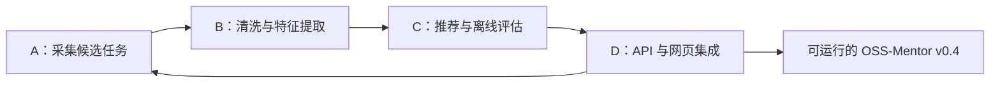

# OSS-Mentor 四人技术分工方案 v0.1

## 1. 文档信息

| 项目 | 内容 |
|---|---|
| 项目名称 | OSS-Mentor：基于开发者成长画像的开源贡献导学系统 |
| 方案版本 | v0.1 |
| 制定日期 | 2026-07-14 |
| 团队规模 | 4 人 |
| 计划周期 | 2 周 |
| 当前阶段 | 本地 MVP 已完成，进入候选池扩充、数据质量、离线评估与系统工程阶段 |

本阶段暂不安排用户招募、访谈、录屏和可用性测试。已经实现的推荐反馈功能继续保留，用于验证数据闭环和为后续真实测试积累信号，但暂不依据少量反馈自动调整推荐算法。

## 2. 本阶段共同目标

本阶段重点验证并完善以下技术链路：

```text
候选任务采集
→ 当前状态复核
→ 数据清洗与特征提取
→ 双通道个性化匹配
→ 离线评估
→ API 与网页展示
→ 本地反馈记录与统计
```

共同验收目标：

| 指标 | 目标 |
|---|---:|
| 接入活跃仓库 | 不少于 10 个 |
| 当前可推荐任务 | 不少于 100 个 |
| 新人友好任务 | 不少于 30 个 |
| 任务类型识别率 | 目标不低于 90% |
| 技能要求覆盖率 | 目标不低于 90% |
| 人工标注任务 | 不少于 30 个 |
| 推荐通道评估 | 新手、进阶均完成 |
| 反馈统计 | 支持当前状态和状态变化路径 |
| 自动化测试 | 全部通过 |
| 环境初始化 | 新电脑可按文档完成 |

## 3. 总体分工

| 成员 | 负责方向 | 核心问题 | 主要产出 |
|---|---|---|---|
| A | 数据源与候选任务采集 | 任务从哪里来，当前是否仍可领取 | 批量同步、状态刷新、候选池报告 |
| B | 数据处理与任务特征 | 任务是什么，需要什么能力 | 数据质量、任务类型、难度与技能要求 |
| C | 推荐算法与离线评估 | 任务应该推荐给谁 | 标注集、排序评估、权重 v0.2、反馈指标 |
| D | 系统工程与集成 | 如何让整个系统稳定运行 | API、网页、迁移、CI、初始化与状态检查 |

技术依赖关系：



四个人在开发初期均可使用现有 SQLite 演示数据并行工作，不需要等待上游任务全部完成。

## 4. 成员 A：数据源与候选任务采集

### 4.1 目标

扩大真实候选任务池，并保证进入推荐系统的 Issue 仍然开放、未分配、没有关联开放 PR，具备实际领取可能性。

### 4.2 工作内容

#### A1. 扩大试点仓库

从当前仓库配置扩展至 10～20 个活跃开源项目，优先选择：

- 最近 30 天仍有代码提交；
- 最近 30 天仍有 Issue 或 PR 活动；
- 存在 `good first issue`、`help wanted` 等候选标签；
- 存在 CONTRIBUTING 文档；
- Issue 描述相对完整；
- 仓库未归档；
- 维护者仍然处理外部贡献；
- 优先覆盖 Python、JavaScript、TypeScript，后续再扩展其他语言。

建议交付：

```text
config/pilot_repositories_v0.2.csv
docs/repository_selection_v0.2.md
```

#### A2. 实现批量同步

建议提供类似命令：

```powershell
python -m oss_mentor sync-candidates `
  --all-enabled `
  --limit-per-repo 20 `
  --allow-network
```

要求：

- 单个仓库失败不影响其他仓库；
- 重复执行不产生重复任务；
- 每个仓库单独记录成功、失败与跳过状态；
- 记录 API 请求数量和限流信息；
- 支持匿名模式和 GitHub Token；
- 日志与 Raw 数据不得包含 Token；
- 具备合理的重试和退避策略。

#### A3. 增加候选状态刷新

建议提供类似命令：

```powershell
python -m oss_mentor refresh-candidates `
  --older-than-hours 24 `
  --allow-network
```

刷新时检查：

- Issue 是否已经关闭；
- 是否已经分配给其他人；
- 是否出现关联开放 PR；
- 是否被锁定；
- 是否出现暂不接受贡献的信号；
- 仓库是否归档；
- 任务是否长期无维护者活动。

#### A4. 输出候选池报告

至少统计：

- 采集仓库数量；
- 发现 Issue 数量；
- GitHub 当前状态复核数量；
- 当前可推荐数量；
- 新人友好数量；
- 已关闭、已分配、已有 PR 的数量；
- 按语言和任务类型的分布；
- 每个仓库的 API 请求成本；
- 同步失败及失败原因。

建议交付：

```text
data/reports/candidate_pool_v0.2.json
docs/candidate_pool_report_v0.2.md
```

### 4.3 验收标准

- 接入不少于 10 个活跃仓库；
- 当前可推荐任务不少于 100 个；
- 新人友好任务不少于 30 个；
- 重复同步不会重复写入；
- 一个仓库失败不会终止整个同步过程；
- 已失效任务能够退出推荐池；
- 批量同步和状态刷新均有自动化测试。

### 4.4 主要代码范围

```text
config/
src/oss_mentor/collector/
src/oss_mentor/candidate_sync.py
src/oss_mentor/candidate_rules.py
```

## 5. 成员 B：数据处理与任务特征

### 5.1 目标

把采集到的 Issue 转换为可用于推荐、能够追溯证据的结构化任务数据。

A 负责“把任务拿回来”，B 负责“理解任务是什么”。

### 5.2 工作内容

#### B1. 字段完整性检查

检查候选任务是否具有：

- 仓库主要语言；
- Issue 标题与正文；
- 标签；
- 当前状态与分配状态；
- PR 关联情况；
- 最后活动时间；
- 平台要求；
- 任务类型；
- 难度特征；
- 技能要求。

输出主要缺失率：

```text
body_text_missing_rate
primary_language_missing_rate
task_type_missing_rate
skill_requirement_missing_rate
github_verification_missing_rate
```

#### B2. 改进任务类型识别

继续支持：

- `bug_fix`
- `testing`
- `documentation`
- `feature`
- `refactor`
- `build_tooling`

综合使用标签、标题和正文证据。每个分类结果必须保留识别证据，不能只保存最终类别。

#### B3. 改进难度估计

分别估计：

- 代码难度；
- 环境配置难度；
- 项目上下文难度；
- 协作难度；
- 预计工作量。

第一阶段继续使用可解释规则，不要求训练机器学习模型。例如：

- 有明确复现步骤时降低理解难度；
- 有验收标准时降低任务不确定性；
- 涉及多个模块时提高代码难度；
- 涉及特定平台时提高环境门槛；
- 评论较多且存在争议时提高协作难度；
- 涉及构建工具时提高环境难度。

#### B4. 改进技能要求提取

目标结构示例：

```json
[
  {
    "skill_name": "Python",
    "minimum_level": 1,
    "importance": 1.0
  },
  {
    "skill_name": "testing",
    "minimum_level": 1,
    "importance": 0.6
  }
]
```

需要区分：

- 核心技能；
- 辅助技能；
- 平台要求；
- 工具要求；
- 可以在任务中学习的技能。

平台要求必须使用专用字段或 `platform:*` 要求，不能由普通技能等级覆盖。

#### B5. 输出数据质量报告

建议提供：

```powershell
python -m oss_mentor report-data-quality
```

建议交付：

```text
data/reports/data_quality_v0.2.json
docs/data_quality_report_v0.2.md
```

### 5.3 验收标准

- 目标不少于 90% 的可推荐任务具有任务类型；
- 目标不少于 90% 的可推荐任务具有技能要求；
- 每个重要特征能追溯到标签、标题或正文证据；
- 难度值全部位于合法范围；
- 平台要求不能被普通技能伪造或覆盖；
- 缺少正文的任务采用保守估计；
- 特征规则具有单元测试。

### 5.4 主要代码范围

```text
src/oss_mentor/task_features.py
src/oss_mentor/sqlite_store.py
db/sqlite/
docs/data_dictionary_v0.1.md
```

## 6. 成员 C：推荐算法与离线评估

### 6.1 目标

通过团队内部标注和离线指标验证推荐排序，形成可复现的匹配算法 v0.2。本角色不承担用户招募和使用研究。

### 6.2 工作内容

#### C1. 建立人工标注测试集

从任务池中抽取 30～50 个任务，由团队内部进行适配性标注。

建议字段：

```text
repository
issue_number
newcomer_fit
growth_fit
code_difficulty
setup_difficulty
clarity
required_skills
critical_blocker
annotation_reason
annotator
```

适配程度可使用：

```text
0 = 不适合
1 = 勉强适合
2 = 比较适合
3 = 非常适合
```

至少选择 10 个任务由两名成员独立标注，用于检查标注一致性。

建议交付：

```text
data/annotations/task_fit_v0.1.csv
docs/task_annotation_guide_v0.1.md
```

#### C2. 评估当前排序

建议提供：

```powershell
python -m oss_mentor evaluate-ranking `
  --track newcomer `
  --annotations data/annotations/task_fit_v0.1.csv

python -m oss_mentor evaluate-ranking `
  --track growth `
  --annotations data/annotations/task_fit_v0.1.csv
```

建议指标：

- `Precision@5`；
- `Precision@10`；
- 新人关键技能不匹配率；
- 平台不匹配率；
- 进阶技能跨度命中率；
- 任务类型多样性；
- 仓库多样性；
- 推荐结果覆盖率。

#### C3. 调整匹配权重

保留当前版本：

```text
developer-task-match-v0.1
```

建立新版本：

```text
developer-task-match-v0.2
```

对比内容包括：

- 调整前后的 Top 10；
- 上升和下降的任务；
- 排名变化原因；
- 两类通道的指标变化；
- 典型正确案例；
- 典型失败案例。

不得直接覆盖旧版本或只凭主观感受调整权重。

#### C4. 推荐反馈统计

基于已有四种反馈状态：

- `interested`：感兴趣；
- `not_suitable`：不适合；
- `started`：已开始；
- `completed`：已完成。

统计：

- 反馈总量；
- 四种当前状态的数量和比例；
- 首次贡献与进阶通道的反馈分布；
- `interested → started` 转化；
- `started → completed` 转化；
- 常见状态变化路径。

当前状态统计使用 `recommendation_feedback`，状态变化路径使用 `recommendation_feedback_event`。暂不根据少量反馈自动训练或更新算法。

#### C5. 输出算法评估报告

建议交付：

```text
data/reports/ranking_evaluation_v0.2.json
docs/ranking_evaluation_v0.2.md
```

报告应包含测试集组成、标注规则、v0.1 指标、v0.2 指标、权重变化、典型案例和当前局限。

### 6.3 验收标准

- 完成不少于 30 个任务标注；
- 新手与进阶通道分别完成评估；
- 有 v0.1 与 v0.2 的指标对照；
- 权重调整有数据依据；
- 能识别并解释典型错误推荐；
- 可以统计当前反馈和状态变化；
- 不使用少量反馈自动更新模型。

### 6.4 主要代码范围

```text
src/oss_mentor/matching.py
src/oss_mentor/task_features.py
scripts/
data/annotations/
docs/ranking_evaluation_v0.2.md
```

## 7. 成员 D：系统工程与集成

### 7.1 目标

保证 A、B、C 的成果能够持续集成，系统可以从空环境初始化、测试、运行和演示。

### 7.2 工作内容

#### D1. 建立持续集成

增加：

```text
.github/workflows/test.yml
```

自动运行：

```powershell
python -m unittest discover -s tests -v
python -m compileall -q src scripts
```

要求：

- 测试不访问真实 GitHub 网络；
- 不使用真实 Token；
- 数据库测试使用临时 SQLite；
- 每个 PR 自动执行；
- 测试失败时不能合并。

#### D2. 一键初始化与环境检查

建议增加：

```powershell
python -m oss_mentor init-demo
```

完成：

- 初始化 SQLite；
- 执行全部数据库迁移；
- 导入两个演示画像；
- 检查候选数据；
- 输出启动命令。

建议再增加：

```powershell
python -m oss_mentor doctor
```

检查：

- Python 版本；
- 数据库是否存在；
- 数据库迁移是否完整；
- 演示画像是否存在；
- 候选任务数量；
- 可推荐任务数量；
- 端口和静态资源状态。

#### D3. 反馈统计 API

建议增加：

```http
GET /api/v1/feedback/summary
```

返回示例：

```json
{
  "current": {
    "total": 20,
    "interested": 8,
    "not_suitable": 5,
    "started": 5,
    "completed": 2
  },
  "by_track": {
    "newcomer": {},
    "growth": {}
  },
  "transitions": {
    "interested_to_started": 4,
    "started_to_completed": 2
  }
}
```

D 负责 API 和数据库查询，C 负责指标定义和结果解释。

#### D4. 系统状态页

建议增加本地团队状态页：

```text
http://127.0.0.1:8765/status
```

展示：

- 数据库状态；
- 仓库数量；
- 候选任务数量；
- 当前可推荐数量；
- 新人任务数量；
- 最后同步时间；
- 数据质量概要；
- 反馈统计；
- API 与匹配版本。

该页面用于团队开发、检查和项目演示，不属于用户研究任务。

#### D5. 管理数据库迁移

建议预留迁移编号：

| 迁移 | 负责人 |
|---|---|
| `004_recommendation_feedback.sql` | 已完成 |
| `005_candidate_refresh.sql` | A |
| `006_feature_quality.sql` | B |
| `007_evaluation_support.sql` | C |
| 后续集成迁移 | D 统一协调 |

规则：

- 已经执行的迁移文件不得直接修改；
- 调整数据库结构必须新增迁移；
- 每个迁移必须能从空数据库执行；
- 数据库升级必须有自动化测试；
- 不允许多人占用同一迁移编号。

#### D6. 维护 API 与网页兼容

任何 API 字段或行为变化都需要同步更新：

- 后端实现；
- 前端调用；
- OpenAPI；
- 自动化测试；
- 错误码与开发文档。

### 7.3 验收标准

- CI 可以自动运行；
- 新电脑可以完成项目初始化；
- `doctor` 能发现常见环境问题；
- 反馈统计接口可用；
- 系统状态页可用；
- 数据库能从空文件执行全部迁移；
- API 修改具有测试和文档；
- 桌面端和移动端页面保持正常。

### 7.4 主要代码范围

```text
src/oss_mentor/api.py
src/oss_mentor/cli.py
src/oss_mentor/sqlite_store.py
db/sqlite/
web/
tests/
.github/
```

## 8. 两周实施计划

### 第 1 天：共同启动

- 所有人运行当前自动化测试；
- 确认四名成员的 A/B/C/D 身份；
- 确认数据库迁移编号；
- 确认新增字段、任务类型和难度枚举；
- 建立任务看板和代码审阅关系；
- 确保四个人均能启动当前网页。

### 第 2～4 天：第一轮并行开发

- A：仓库筛选、批量同步；
- B：字段缺失统计、任务类型和技能规则；
- C：标注规范、抽样标注、评估脚本；
- D：CI、初始化命令、反馈统计 API。

### 第 5 天：第一次集成

检查：

```text
A 采集的新任务
→ B 能完成特征提取
→ C 能生成推荐和评估
→ D 的 API 与页面能展示
```

重点检查字段命名、空值、数据库迁移、旧数据库升级和自动化测试。

### 第 6～7 天：修复与扩充

- A 继续扩大候选池；
- B 修复新数据暴露出的特征问题；
- C 完成人工标注集；
- D 完善系统状态和初始化流程。

### 第 8～10 天：数据质量与算法评估

- A 输出候选池报告；
- B 输出数据质量报告；
- C 完成匹配 v0.1 离线评估；
- D 完成 API、统计与系统稳定性检查。

### 第 11 天：匹配权重 v0.2

C 提出权重调整方案，团队共同检查：

- 新人是否出现过难任务；
- 进阶开发者是否得到过于简单的任务；
- 平台门槛是否正确；
- 单一仓库是否占据全部推荐；
- 某类任务是否过度集中；
- 调整后指标是否真实改善。

### 第 12 天：第二次完整集成

完整运行：

```text
初始化数据库
→ 批量采集
→ 当前状态复核
→ 特征提取
→ 生成推荐
→ 保存反馈
→ 查看反馈统计
→ 查看数据质量
```

### 第 13 天：文档和演示材料

- A：候选池与采集成本报告；
- B：特征与数据质量报告；
- C：推荐算法评估报告；
- D：系统、API、数据库和测试报告。

### 第 14 天：阶段验收

按照第 2 节的共同目标进行最终验收，并演示完整技术链路。

## 9. Git 与代码协作规则

`main` 分支应始终保持可运行。每项工作使用独立分支，例如：

```text
feat/batch-candidate-sync
feat/candidate-refresh
feat/task-feature-quality
feat/ranking-evaluation
feat/feedback-summary
feat/project-doctor
docs/candidate-pool-report
```

每个 PR 至少说明：

- 修改目的；
- 修改范围；
- 测试方式和测试结果；
- 是否修改数据库；
- 是否修改 API；
- 示例输出或页面截图；
- 相关文档。

审阅关系：

- A 的采集代码由 B 审阅；
- B 的特征代码由 C 审阅；
- C 的算法代码由 B 审阅；
- D 的 API 和数据库由对应功能负责人审阅；
- 数据库迁移至少两人确认；
- 影响推荐分数的修改必须展示前后结果。

每日简短同步以下内容：

```text
昨天完成了什么
今天准备做什么
当前有什么阻塞
是否修改了 API 或数据库
是否需要其他成员配合
```

## 10. 本阶段暂不实施

为避免范围失控，本阶段暂不实施：

- 用户招募、访谈、录屏和可用性测试；
- GitHub OAuth 登录；
- 自动分析用户全部 GitHub 历史；
- 复杂机器学习模型；
- 根据少量反馈自动更新算法；
- PostgreSQL 正式部署；
- 云端多用户系统；
- 自动替用户领取 Issue；
- 自动向 GitHub 发送评论。

## 11. 分工总结

```text
A：任务从哪里来，以及现在还能不能做
B：任务是什么，以及需要哪些能力
C：任务应该推荐给谁，以及推荐是否合理
D：整个系统如何稳定运行和持续集成
```

本阶段完成后，再根据候选池规模、数据质量和离线评估结果，决定是否进入真实用户验证阶段。
