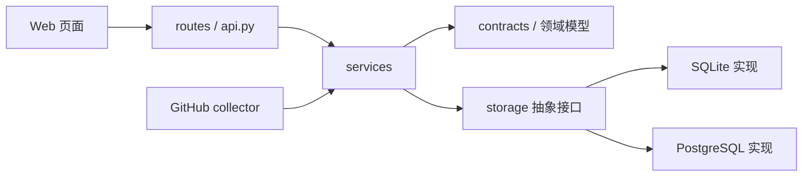

# OSS-Mentor 四人并行开发分工方案 v0.2

## 1. 文档信息

| 项目 | 内容 |
|---|---|
| 项目名称 | OSS-Mentor：基于开发者成长画像的开源贡献导学系统 |
| 方案版本 | v0.2 |
| 制定日期 | 2026-07-29 |
| 团队规模 | 4 人 |
| 计划周期 | 3 周 |
| 目标版本 | v0.5.0 可部署完整版 |
| 当前基线 | v0.4 本地推荐、双轨评估、反馈闭环和系统状态已实现 |
| 本阶段原则 | 四个人从同一个最新 `main` 创建独立分支，按文件所有权并行开发，最后统一集成 |

本阶段不安排外部用户招募、访谈、录屏或可用性测试。团队优先完成产品功能、GitHub 集成、推荐能力、数据库、部署和自动化测试，使系统达到可持续运行和后续测试的条件。

## 2. 本阶段目标与范围

### 2.1 最终技术链路

```text
GitHub OAuth 登录
→ 获取用户授权范围内的公开开发信息
→ 生成并允许编辑开发者画像
→ 定时增量同步候选 Issue
→ 实时排除关闭、已分配、已有 PR 或仓库不活跃的任务
→ 分别生成新人轨和成长轨推荐
→ 展示匹配证据、技能差距和推荐原因
→ 用户收藏、忽略、开始或完成任务
→ 保存反馈状态和推荐快照
→ 状态页展示数据质量、同步状态和服务健康度
→ 通过 Docker 在 SQLite 或 PostgreSQL 模式运行
```

### 2.2 必须完成

- GitHub OAuth 登录、退出和当前用户会话；
- 自动导入 GitHub 公开数据并生成可编辑画像；
- 候选任务定时增量同步、重试、限流和状态刷新；
- 推荐算法 v0.3，包含双轨、多样性、解释和负反馈降权；
- 登录页、画像页、推荐页、任务详情页和系统状态页；
- SQLite 本地模式和 PostgreSQL 部署模式；
- Docker Compose、一键初始化、健康检查和备份说明；
- CI 自动执行单元测试、契约测试、迁移测试和端到端冒烟测试；
- OpenAPI v0.5、数据字典、部署和故障排查文档。

### 2.3 本阶段不做

- 不自动替用户领取 Issue；
- 不自动向 GitHub 发送评论；
- 不使用少量反馈自动训练或更新模型；
- 不接入复杂机器学习或大模型在线推理；
- 不读取用户私有仓库；
- 不保存 GitHub Access Token 明文；
- 不做组织级多租户、计费或管理员权限系统；
- 不承诺正式公网运营，只达到可部署和可内部试运行状态。

## 3. 并行启动方式：四个人直接从 main 开始

四个人可以直接从同一个最新 `main` 创建各自的功能分支，不需要等待额外的前置 PR，也不需要先创建标签或公共骨架。

开始开发前，四个人分别执行：

```powershell
git switch main
git pull --ff-only origin main
git rev-parse HEAD
```

四个人需要在群里确认 `git rev-parse HEAD` 输出相同，然后分别创建分支：

```text
A：feat/v05-data-sync
B：feat/v05-profile-import
C：feat/v05-ranking-v3
D：feat/v05-platform
```

本文件第 5～8 节就是四个人共同遵守的接口和文件边界，不再另外建立前置 PR。并行期间遵循以下简单规则：

1. 每个人只直接修改第 8 节分配给自己的文件；
2. A、B、C 不直接修改 `api.py`、`cli.py`、`sqlite_store.py` 和 OpenAPI；
3. A、B、C 在自己的模块中完成业务函数、测试和示例数据；
4. D 负责把三人的业务函数接入共享 API、数据库 facade 和网页入口；
5. 如果确实需要修改接口字段，先在群里用请求与响应示例确认，再由 D 统一修改共享文件；
6. 各成员可以使用第 13 节的 fixture 独立开发，不需要等待其他成员完成；
7. 每个成员在提 PR 前把最新 `main` 合入或 rebase 到自己的分支，并自行解决只涉及本人文件的冲突。

这样四个人可以在第一天同时开始工作，同时通过文件唯一负责人制度避免多人改同一个文件。

## 4. 总体架构和依赖方向

### 4.1 分层规则



依赖只能从左向右：

- 页面只能调用已写入 OpenAPI 的接口；
- `routes` 只负责 HTTP 参数解析、认证检查和响应转换；
- `services` 负责业务流程，不能直接拼 HTTP 响应；
- 领域枚举和共享数据结构只定义在 `contracts.py`；
- 业务模块只能依赖存储接口，不能直接依赖 SQLite SQL；
- SQLite 与 PostgreSQL 必须实现相同的存储接口；
- 推荐算法不得调用网络；
- GitHub 采集模块不得直接调用推荐算法或修改网页。

### 4.2 兼容性要求

- 保留现有 `/api/v1/*` 路径，不新建 `/api/v2`；
- `api_version` 从 `v0.4` 更新为 `v0.5`；
- 已有字段只能保持或新增，不能在 v0.5 中重命名或删除；
- 已有本地自定义画像推荐仍可在未登录模式使用；
- SQLite 演示模式必须继续可运行；
- 新增登录能力不能破坏现有 fixture 和本地演示流程。

## 5. 共享契约

### 5.1 统一约定

| 项目 | 统一规定 |
|---|---|
| 时间 | UTC ISO 8601，例如 `2026-07-29T12:30:00Z` |
| ID | 数据库内部 ID 使用整数；跨接口用户 ID 使用 UUID 字符串 |
| JSON 字段 | 使用 `snake_case` |
| 布尔值 | JSON 使用 `true/false`；SQLite 使用 `0/1` |
| 空值 | 未知值使用 `null`，不用空字符串代替 |
| 分页 | 使用不透明 `cursor`，禁止把页码作为长期接口契约 |
| 列表上限 | 默认 20，最大 100 |
| 错误响应 | 统一 `{error: {code, message, details?, request_id}}` |
| 请求追踪 | 每个 API 响应包含 `request_id` |
| 枚举变更 | 必须更新 `contracts.py`、OpenAPI 和契约测试 |
| Token | 只能保存加密值或短期会话引用，日志中必须脱敏 |

### 5.2 固定枚举

```text
ServiceTrack:
  newcomer
  growth

FeedbackState:
  interested
  not_suitable
  started
  completed

TaskType:
  bug_fix
  testing
  documentation
  feature
  refactor
  build_tooling

CandidateAvailability:
  available
  closed
  assigned
  linked_open_pr
  locked
  repository_inactive
  temporarily_unverified

SyncRunStatus:
  pending
  running
  succeeded
  partially_succeeded
  failed
```

任何成员不得自行增加同义值，例如不能同时出现 `not-suitable`、`rejected` 或 `in_progress`。

### 5.3 核心服务接口

以下签名是逻辑契约。具体实现可使用 `Protocol`、`dataclass` 和同步方法，但名称、输入责任和返回字段必须保持一致。

```python
class CandidateService:
    def sync_enabled_repositories(
        self,
        *,
        limit_per_repository: int,
        requested_by: str,
    ) -> SyncBatchResult: ...

    def refresh_stale_candidates(
        self,
        *,
        older_than_hours: int,
        requested_by: str,
    ) -> RefreshBatchResult: ...

    def candidate_detail(self, task_candidate_id: int) -> CandidateDetail: ...


class ProfileService:
    def import_github_profile(
        self,
        *,
        user_id: str,
        github_login: str,
        consent_version: str,
    ) -> DeveloperProfileV2: ...

    def update_profile(
        self,
        *,
        user_id: str,
        profile: DeveloperProfileV2,
    ) -> DeveloperProfileV2: ...


class RecommendationService:
    def recommend(
        self,
        *,
        profile: DeveloperProfileV2,
        limit: int,
        excluded_candidate_ids: tuple[int, ...] = (),
    ) -> RecommendationBatchV3: ...

    def recommendation_detail(
        self,
        *,
        profile: DeveloperProfileV2,
        task_candidate_id: int,
    ) -> RecommendationItemV3: ...
```

### 5.4 推荐结果结构

所有推荐接口使用同一种 `RecommendationItemV3`：

```json
{
  "task_candidate_id": 123,
  "repository_full_name": "owner/repository",
  "issue_number": 45,
  "title": "Improve error handling",
  "html_url": "https://github.com/owner/repository/issues/45",
  "service_track": "newcomer",
  "score": 0.82,
  "difficulty": {
    "code": 1,
    "setup": 1
  },
  "matched_skills": ["Python", "testing"],
  "missing_skills": ["pytest"],
  "reasons": [
    {
      "code": "language_match",
      "label": "符合偏好语言",
      "evidence": "仓库主要语言为 Python",
      "score_delta": 0.18
    }
  ],
  "warnings": [],
  "availability": "available",
  "verified_at": "2026-07-29T12:30:00Z",
  "feedback_state": null
}
```

约束：

- `score` 范围为 `0.0～1.0`；
- `reasons` 至少包含一项，且必须来自固定原因码；
- `score_delta` 之和不要求等于最终分数，但必须能解释排序变化；
- `missing_skills` 只表示成长空间，不能绕过难度硬门槛；
- `availability != available` 的任务不能出现在推荐列表；
- 同一页同一仓库默认最多出现 3 个任务。

## 6. API v0.5 规定

### 6.1 接口所有权

| 路径 | 方法 | 负责人 | 说明 |
|---|---|---|---|
| `/health` | GET | D | 进程健康和数据库连通性 |
| `/api/v1/status` | GET | D，A 提供同步字段 | 系统、数据库、同步和候选池状态 |
| `/api/v1/auth/github/start` | GET | D | 创建 OAuth state 并返回授权地址 |
| `/api/v1/auth/github/callback` | GET | D | 校验 state、换取授权并创建会话 |
| `/api/v1/auth/logout` | POST | D | 撤销当前本地会话 |
| `/api/v1/me` | GET | D | 返回当前登录用户公开信息 |
| `/api/v1/me/profile` | GET | B | 返回当前用户画像 |
| `/api/v1/me/profile` | PUT | B | 校验并更新当前用户画像 |
| `/api/v1/me/profile/import-github` | POST | B | 使用当前授权重新生成画像建议 |
| `/api/v1/profiles` | GET | B | 保留公开演示画像 |
| `/api/v1/tasks/{task_candidate_id}` | GET | A | 返回任务详情和当前可用性 |
| `/api/v1/recommendations` | GET | C | 登录用户或演示画像推荐 |
| `/api/v1/recommendations/custom` | POST | C | 保留未登录自定义画像推荐 |
| `/api/v1/recommendation-options` | POST | C | 保留选项库存统计 |
| `/api/v1/feedback` | POST | C | 保存反馈状态并追加事件 |
| `/api/v1/feedback/summary` | GET | C | 反馈漏斗和状态变化统计 |

D 是 OpenAPI 文件唯一直接编辑者。A、B、C 如果需要修改接口，必须在自己的 PR 描述中提供：

```text
接口路径：
请求示例：
成功响应示例：
错误码：
是否需要登录：
是否影响已有客户端：
```

D 在集成 PR 中统一更新 `docs/openapi_v0.5.yaml` 和路由注册。A、B、C 不直接修改 `api.py`。

### 6.2 登录与会话

OAuth 最小权限：

```text
read:user
user:email（仅在确实需要读取公开邮箱之外的邮箱时申请）
```

默认不申请：

```text
repo
write:issues
workflow
admin:org
```

会话 Cookie 规定：

- 名称：`oss_mentor_session`；
- `HttpOnly=true`；
- `SameSite=Lax`；
- 生产环境 `Secure=true`；
- Cookie 只保存随机会话 ID，不保存 GitHub Token；
- OAuth state 一次性使用，10 分钟过期；
- 本地会话默认 7 天过期；
- 退出后服务端会话立即失效。

### 6.3 错误码

| HTTP | code | 使用场景 |
|---:|---|---|
| 400 | `invalid_request` | 参数格式错误 |
| 401 | `authentication_required` | 未登录访问受保护接口 |
| 403 | `insufficient_permission` | GitHub 授权范围不足 |
| 404 | `not_found` | 用户、画像或任务不存在 |
| 409 | `state_conflict` | OAuth state、反馈状态或同步任务冲突 |
| 413 | `payload_too_large` | 请求体超限 |
| 415 | `unsupported_media_type` | 非 JSON 请求 |
| 422 | `profile_validation_failed` | 画像字段合法但无法通过业务校验 |
| 429 | `rate_limited` | 本地或 GitHub 限流 |
| 502 | `github_upstream_error` | GitHub API 返回不可恢复错误 |
| 503 | `service_not_ready` | 数据库迁移或后台任务未就绪 |

## 7. 数据库与迁移分配

### 7.1 迁移编号

现有 SQLite 迁移为 `001～006`。v0.5 的编号固定如下，禁止抢号：

| 编号 | 负责人 | SQLite 文件 | 主要内容 |
|---:|---|---|---|
| 007 | D | `007_identity_sessions.sql` | 用户、OAuth 身份、加密凭据引用和会话 |
| 008 | A | `008_sync_runs.sql` | 同步批次、单仓库结果、限流和重试记录 |
| 009 | B | `009_github_profile_evidence.sql` | GitHub 画像导入、技能证据和用户画像关联 |
| 010 | C | `010_recommendation_runs.sql` | 推荐批次、版本、快照和解释原因 |

PostgreSQL 使用一个初始基线：

```text
db/postgres/001_initial.sql
```

该文件由 D 维护，内容必须等价于 SQLite `001～010` 的最终结构。A、B、C 只提交自己的 SQLite 增量迁移和一份 PostgreSQL 字段变更说明，不直接同时编辑 `db/postgres/001_initial.sql`。

### 7.2 数据库规则

- v0.5 迁移只允许新增表、列和索引，不删除已有字段；
- 每个迁移必须可在空数据库和 v0.4 数据库上执行；
- SQLite 迁移不得依赖 PostgreSQL 专有语法；
- 所有外键必须明确 `ON DELETE` 行为；
- Token、Cookie 和 OAuth state 不得出现在报告表；
- 原始 GitHub JSON 只保留必要字段，不无限期保存完整响应；
- 所有用户相关表必须有删除路径；
- 每个迁移都要增加迁移测试；
- 数据库 schema 修改必须由 D 和对应业务负责人共同审阅。

## 8. 文件所有权与冲突预防

### 8.1 唯一所有者文件

| 文件或目录 | 唯一负责人 | 其他成员规则 |
|---|---|---|
| `src/oss_mentor/api.py` | D | 不直接修改，通过 route/service 接口接入 |
| `src/oss_mentor/cli.py` | D | 在 PR 中提交 CLI 接口需求，由 D 集成 |
| `src/oss_mentor/contracts.py` | D 保管，四人共审 | 群内确认字段后由 D 统一修改 |
| `src/oss_mentor/sqlite_store.py` | D | 只保留兼容 facade，业务代码逐步迁出 |
| `src/oss_mentor/storage/base.py` | D | 只定义 Protocol 和事务边界 |
| `docs/openapi_v0.5.yaml` | D | A/B/C 提供接口提案，不直接修改 |
| `web/index.html` | D | 页面功能使用独立页面或组件文件 |
| `web/assets/styles.css` | D | 只放设计变量和共享样式 |
| `.github/workflows/` | D | 其他成员只在 PR 描述中提出 CI 需求 |
| `Dockerfile`、`compose.yaml` | D | 其他成员不直接修改 |

### 8.2 成员专属范围

| 成员 | 可直接修改的主要范围 |
|---|---|
| A | `collector/`、`candidate_sync.py`、`candidate_refresh.py`、`candidate_report.py`、`candidate_rules.py`、`storage/candidates.py`、对应测试与采集文档 |
| B | `developer_profiles.py`、`task_features.py`、`data_quality.py`、`services/profile_service.py`、`storage/profiles.py`、`web/profile.*`、对应测试与画像文档 |
| C | `matching.py`、`ranking_evaluation.py`、`services/recommendation_service.py`、`storage/recommendations.py`、`web/recommendations.*`、对应测试与评估文档 |
| D | API、认证、会话、共享存储、PostgreSQL、CLI、网页壳、部署、CI、端到端测试和运维文档 |

### 8.3 共享文件变更流程

如果 A、B 或 C 必须修改 D 所有的共享文件：

1. 先在 PR 描述中写出需求和调用示例；
2. 新增自己的服务实现和单元测试；
3. 不在同一个 PR 中顺手修改 `api.py`、`cli.py` 或 OpenAPI；
4. D 在集成分支完成最小胶水代码；
5. 原负责人运行契约测试确认行为；
6. 两个 PR 通过交叉引用关联。

禁止：

- 四个人同时向 `sqlite_store.py` 添加方法；
- 多人同时编辑同一个 OpenAPI 文件；
- 在业务 PR 中重排公共 CSS；
- 为解决冲突直接覆盖别人的实现；
- 在没有迁移的情况下修改数据库查询；
- 在接口实现完成后才临时决定字段名称。

## 9. 成员 A：GitHub 数据与候选任务

分支：

```text
feat/v05-data-sync
```

### A1. 增量同步

- 支持按仓库更新时间增量拉取；
- 记录同步游标、ETag 或 `If-Modified-Since` 信息；
- 单个仓库失败不终止整个批次；
- 实现指数退避和最大重试次数；
- 记录 GitHub rate limit remaining/reset；
- 同步重复执行不产生重复 Issue；
- Token、邮箱和授权头不得写入日志。

### A2. 可用性复核

- 检查 Issue 是否关闭、锁定或已分配；
- 检查是否存在关联开放 PR；
- 检查仓库是否归档、禁用或长期不活跃；
- 推荐前超过 24 小时未验证的任务标记为 `temporarily_unverified`；
- 详情页打开前允许触发一次轻量复核；
- 明确输出排除原因，不只返回布尔值。

### A3. 后台同步记录

实现迁移：

```text
db/sqlite/008_sync_runs.sql
```

至少包含：

- `sync_run`；
- `sync_repository_result`；
- 批次状态、开始/结束时间；
- 请求数、成功数、失败数、跳过数；
- 限流剩余额度和重试次数；
- 脱敏后的错误码与错误摘要。

### A4. 报告和状态输出

- 候选池总量和当前可推荐量；
- 新人任务数量；
- 语言、任务类型和仓库分布；
- 最近同步时间和失败仓库；
- 关闭、已分配、已有 PR、仓库不活跃数量；
- 平均每个仓库 API 请求成本。

### A5. 测试与交付

- GitHub API 模拟测试；
- 403、404、429、5xx 和网络超时测试；
- 重复同步幂等测试；
- 单仓库失败隔离测试；
- 状态刷新测试；
- SQLite 008 迁移测试；
- 提供固定候选 fixture：`fixtures/contracts/v0.5/candidates.json`。

完成标准：

- 无网络测试全部使用 fixture 或 mock；
- 一次批量同步部分失败时结果为 `partially_succeeded`；
- 已失效任务不会进入 C 的推荐输入；
- A 不修改推荐权重、用户画像或 API 路由。

## 10. 成员 B：GitHub 画像与任务特征

分支：

```text
feat/v05-profile-import
```

### B1. GitHub 画像导入

在用户明确同意后，从公开数据提取：

- 常用语言及占比；
- 近期活跃仓库；
- 提交、PR、Issue 和 Review 信号；
- 测试、文档、构建工具等技能证据；
- 贡献活跃时间范围；
- 推断结果的证据来源和置信度。

不得：

- 仅凭仓库语言直接判定熟练度最高；
- 把私有仓库数量或内容写入数据库；
- 用贡献次数直接判定代码能力；
- 静默覆盖用户手工修改过的画像字段。

### B2. 画像合并规则

字段来源优先级：

```text
用户手工确认
> 用户手工填写
> GitHub 明确证据
> GitHub 弱推断
> 默认值
```

重新导入 GitHub 数据时：

- 保留用户锁定字段；
- 对变化字段生成建议，不直接覆盖；
- 保存 `source`、`evidence`、`confidence` 和 `observed_at`；
- 支持用户接受或拒绝单项建议。

### B3. 任务特征 v0.3

- 保持现有任务类型枚举；
- 补充技能证据和置信度；
- 区分代码难度和环境搭建难度；
- 输出缺失字段原因；
- 特征规则必须版本化；
- 新规则不得让现有覆盖率指标无声下降。

### B4. 数据库存储

实现迁移：

```text
db/sqlite/009_github_profile_evidence.sql
```

至少包含：

- 用户与 `developer_profile` 的关联；
- GitHub 画像导入批次；
- 画像字段建议；
- 技能证据；
- 用户是否接受建议；
- 同意版本和导入时间。

### B5. 页面、测试与交付

- `web/profile.html`；
- `web/assets/profile.js`；
- `web/assets/profile.css`；
- GitHub 导入预览、字段来源、证据和编辑状态；
- 画像校验测试；
- 手工字段不被覆盖测试；
- 技能证据和置信度测试；
- SQLite 009 迁移测试；
- 提供固定画像 fixture：`fixtures/contracts/v0.5/profiles.json`。

完成标准：

- 没有 GitHub 数据时仍可手工创建画像；
- 导入相同数据两次结果幂等；
- 画像可以被 C 直接转换为 `DeveloperProfileV2`；
- B 不修改推荐权重、OAuth 会话实现或公共 API 路由。

## 11. 成员 C：推荐算法 v0.3 与解释

分支：

```text
feat/v05-ranking-v3
```

### C1. 排序模型 v0.3

硬门槛：

- 任务必须可用；
- 语言、操作系统和任务类型满足用户硬偏好；
- 代码难度和搭建难度不超过画像上限；
- 新人轨不得推荐明显超出能力范围的任务。

软评分至少包含：

- 语言匹配；
- 任务类型匹配；
- 已有技能覆盖；
- 合理的技能成长空间；
- Issue 描述完整度；
- 仓库活跃度；
- 任务新鲜度；
- 新人标签和贡献文档；
- 用户历史负反馈。

### C2. 多样性

- 默认 Top 10 中单仓库最多 3 个任务；
- 相同任务类型不得占满全部结果；
- 多样性重排不得突破硬门槛；
- 原始分数和重排后位置都要可追踪；
- 候选不足时允许放宽多样性，但必须输出 warning。

### C3. 推荐解释

解释使用固定原因码，例如：

```text
language_match
task_type_match
skill_match
skill_stretch
newcomer_signal
active_repository
fresh_issue
contributing_guide_available
negative_feedback_penalty
diversity_rerank
```

每项解释包含：

- 面向用户的简短标签；
- 可验证证据；
- 对分数的正负影响；
- 使用的特征版本。

### C4. 推荐快照

实现迁移：

```text
db/sqlite/010_recommendation_runs.sql
```

至少记录：

- 推荐批次 ID；
- 用户或匿名反馈上下文；
- service track；
- match version；
- profile snapshot hash；
- candidate snapshot hash；
- 推荐任务、原始分数、最终位置；
- 推荐原因和 warning；
- 创建时间。

不得保存不必要的完整用户 GitHub 原始数据。

### C5. 评估、页面与交付

- 新人轨与成长轨分别评估；
- 保留固定人工标注集接口；
- 增加多样性指标和失效任务泄漏率；
- 每次权重变更展示前后对比；
- `web/recommendations.html`；
- `web/assets/recommendations.js`；
- `web/assets/recommendations.css`；
- 排序、硬门槛、多样性、解释和负反馈测试；
- SQLite 010 迁移测试；
- 提供推荐 fixture：`fixtures/contracts/v0.5/recommendations.json`。

完成标准：

- 相同输入和版本产生稳定顺序；
- 推荐结果符合 `RecommendationItemV3`；
- 失效任务泄漏率为 0；
- C 不调用 GitHub 网络，不修改 OAuth、画像导入和 API 路由。

## 12. 成员 D：平台、API、数据库与部署

分支：

```text
feat/v05-platform
```

### D1. 共享接口和模块拆分

- 从最新 `main` 直接创建 `feat/v05-platform`；
- 根据本文第 5～8 节建立共享接口骨架；
- 将 `sqlite_store.py` 逐步改为兼容 facade；
- 建立 `storage` 接口和实现边界；
- 建立 route 注册机制；
- 保持 v0.4 测试兼容；
- 负责共享接口的最终合并。

### D2. GitHub OAuth 和会话

- 登录、回调、state 校验和退出；
- Access Token 加密或使用安全凭据引用；
- 会话过期和撤销；
- CSRF、开放重定向和 Cookie 安全检查；
- 未配置 OAuth 时给出清晰提示；
- 本地演示模式不强制登录。

实现迁移：

```text
db/sqlite/007_identity_sessions.sql
```

### D3. API 与网页壳

- 注册 A/B/C 提供的 service；
- 实现统一错误响应和 request ID；
- 登录页、导航、共享设计变量；
- 任务详情页面壳和反馈按钮集成；
- 加载、空数据、401、404、429、502 和 503 页面；
- 更新 OpenAPI v0.5；
- 保持静态资源路径稳定。

### D4. PostgreSQL 和部署

- PostgreSQL 基线迁移；
- SQLite/PostgreSQL 存储接口一致；
- Dockerfile；
- Compose 中包含应用和 PostgreSQL；
- 环境变量模板；
- 一键初始化和迁移；
- 健康检查；
- 备份、恢复和回滚说明；
- 不把任何真实密钥提交到仓库。

### D5. CI 和系统测试

CI 至少包含：

```text
unit-tests
contract-tests
sqlite-migration-tests
postgres-migration-tests
web-smoke-tests
compile-check
secret-scan
docker-build
```

完成标准：

- 一条命令启动完整系统；
- SQLite 和 PostgreSQL 均通过同一组存储契约测试；
- API 与 OpenAPI 契约一致；
- D 不在集成时改写 A/B/C 的核心业务逻辑；
- 如发现业务问题，退回对应负责人修改。

## 13. 四人联调数据

为了避免等待真实网络和上游代码，每个成员必须先交付自己的契约 fixture。

```text
fixtures/contracts/v0.5/
├── candidates.json        # A 负责
├── profiles.json          # B 负责
├── recommendations.json   # C 负责
├── github_user.json       # B 负责，脱敏
├── sync_results.json      # A 负责
└── errors.json            # D 负责
```

规则：

- fixture 中不能出现真实 Token、邮箱或私有仓库；
- ID 固定，测试不得依赖生成顺序；
- 时间固定，不使用运行时当前时间；
- 修改 fixture 必须说明影响哪些成员；
- C 可以使用 A/B 的 fixture 开发，不需要等待采集和画像功能完成；
- D 可以使用三人的 fixture 完成 API 和页面集成。

## 14. Git 和 PR 协作规则

### 14.1 分支

```text
feat/v05-data-sync
feat/v05-profile-import
feat/v05-ranking-v3
feat/v05-platform
```

禁止四个人在同一功能分支开发。禁止直接向 `main` 推送。

### 14.2 每日同步

每天开始工作前：

```powershell
git fetch origin
git rebase origin/main
```

存在未提交更改时先提交到个人分支或安全暂存，禁止使用 `git reset --hard` 清理他人工作。

每天同步以下内容：

```text
昨天完成：
今天计划：
当前阻塞：
新增或修改的接口：
新增或修改的数据库字段：
是否需要其他成员确认契约：
```

### 14.3 PR 粒度

每位成员至少拆成两个 PR：

1. 数据结构、接口实现和 fixture；
2. 完整功能、测试、报告或页面。

单个 PR 尽量不超过 800 行核心代码变更；生成报告和 fixture 不计入核心代码行数。

### 14.4 PR 必填内容

```text
目标：
修改范围：
明确未修改范围：
接口变化：
数据库迁移：
兼容性影响：
测试命令和结果：
页面截图或示例输出：
需要谁审阅：
```

### 14.5 交叉审阅

| PR 来源 | 第一审阅人 | 第二审阅人 |
|---|---|---|
| A 数据采集 | B | D |
| B 画像特征 | C | D |
| C 推荐算法 | B | D |
| D API/数据库 | 对应业务负责人 | 另一名未参与成员 |
| 数据库迁移 | D | 对应业务负责人 |
| 契约变更 | 所有受影响成员 | 至少 2 人批准 |

## 15. 三周并行计划

### 第 0 天：同步 main 并同时开工

- 确认上一阶段代码已经合并到 `main`；
- 四个人拉取最新 `main` 并确认起点 commit 相同；
- 四个人分别创建 A、B、C、D 功能分支；
- 共同阅读第 5～8 节，确认接口、迁移编号和文件所有权；
- 四个人当天即可同时开始实现，不需要等待 D 先提交公共代码；
- A、B、C 先实现自己的业务模块和 fixture，D 同时实现共享接口与平台骨架。

### 第 1 周：独立实现

| 成员 | 本周目标 |
|---|---|
| A | 增量同步、状态刷新、008 迁移和 fixture |
| B | GitHub 画像导入、画像合并、009 迁移和 fixture |
| C | 推荐 v0.3 核心、多样性、解释结构和 fixture |
| D | OAuth、007 迁移、存储拆分、PostgreSQL 骨架 |

周末集成检查：

- 四套迁移能按 `007→008→009→010` 执行；
- A/B/C fixture 均符合契约；
- 所有个人分支已 rebase 到最新 `main`；
- 不存在多人修改同一共享文件的未解决情况。

### 第 2 周：页面与接口集成

| 成员 | 本周目标 |
|---|---|
| A | 同步统计、任务详情数据、异常和限流处理 |
| B | 画像导入与编辑页面、证据展示 |
| C | 推荐页、任务解释、快照和离线对比 |
| D | API 路由、登录流程、网页导航、PostgreSQL 适配 |

周末端到端链路：

```text
登录
→ 导入画像
→ 编辑画像
→ 获取推荐
→ 查看任务详情
→ 保存反馈
→ 查看系统状态
```

### 第 3 周：工程加固和发布

- A：同步稳定性、失败恢复和候选池报告；
- B：画像边界情况、数据质量和说明文档；
- C：回归评估、权重对比和推荐报告；
- D：Docker、CI、备份恢复、错误页面和发布文档；
- 四人共同完成完整回归和演示脚本；
- 冻结功能后只修复阻塞发布的问题；
- 发布 `v0.5.0`。

## 16. 验收标准

### 16.1 功能

- GitHub OAuth 登录、退出和会话过期正常；
- 未配置 OAuth 时本地演示模式仍可运行；
- 用户可以导入、查看和编辑画像；
- 用户手工字段不会被 GitHub 重导入覆盖；
- 候选任务可以增量同步和定时刷新；
- 关闭、已分配、已有 PR 和不活跃仓库任务不会被推荐；
- 新人轨和成长轨均能生成推荐；
- 推荐结果包含原因、证据、技能差距和 warning；
- 反馈状态可以恢复，推荐快照可以追踪；
- 所有页面具备加载、空数据和错误状态。

### 16.2 数据与算法

- 接入活跃仓库不少于 10 个；
- 当前可推荐任务不少于 100 个；
- 新人友好任务不少于 30 个；
- 任务类型识别率不低于 90%；
- 技能要求覆盖率不低于 90%；
- 失效任务泄漏率为 0；
- Top 10 单仓库默认不超过 3 个；
- 推荐版本、画像版本和特征版本均可追踪；
- 固定离线评估可以一条命令重跑。

### 16.3 工程

- 全新环境可以使用 Docker Compose 启动；
- SQLite 和 PostgreSQL 都能初始化和迁移；
- v0.4 SQLite 数据库可以升级到 v0.5；
- 所有自动化测试通过；
- OpenAPI 与实际接口一致；
- CI 可以构建镜像；
- 健康检查能区分进程存活和数据库未就绪；
- 日志中不存在 Token、Cookie、OAuth code 或敏感用户信息；
- 备份和恢复流程至少演练一次；
- README 包含本地开发、Docker 部署和故障排查入口。

## 17. 阶段完成定义

只有同时满足以下条件，v0.5 才算完成：

1. 四条主线全部合并到 `main`；
2. `main` 自动化测试全部通过；
3. SQLite 与 PostgreSQL 两种模式均完成冒烟测试；
4. 从登录到反馈的端到端链路可重复演示；
5. 所有迁移、接口和环境变量都有文档；
6. 没有未处理的 P0/P1 缺陷；
7. 发布 `v0.5.0` 标签和变更说明；
8. 团队成员在新目录按文档完成一次冷启动。

完成本阶段后，再决定是进入真实用户验证，还是继续开发管理员后台、更多代码托管平台或更复杂的推荐模型。

## 18. 共享接口变更记录模板

并行开发期间需要修改共享接口时，在 PR 中追加：

```text
变更编号：CONTRACT-v0.5-XXX
提出人：
变更原因：
影响接口：
影响数据库：
影响成员：
兼容策略：
fixture 是否更新：
测试是否更新：
批准人：
```

未填写上述信息的共享接口变更不得合并。
